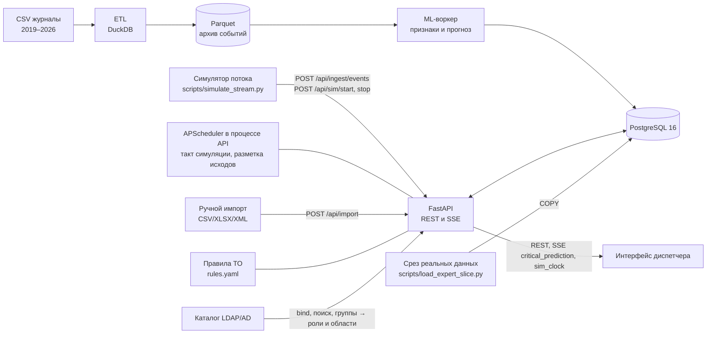

# Архитектура



Сотни миллионов сырых событий хранятся в Parquet. В PostgreSQL лежит оперативный контур: справочники, суточные агрегаты, события за последние 30 дней, прогнозы, решения, заявки. Так соблюдается разделение на архив, оперативный контур и аналитические витрины, которого требует заказчик.

## Что готово

| Компонент | Состояние |
|---|---|
| PostgreSQL, схема, миграции Alembic | готово |
| REST API со Swagger, JWT, роли, audit_log | готово; демо-сид или реальные данные из ML |
| Ручной импорт CSV/XLSX/XML, выгрузка журнала в XLSX и XML | готово; XML — `defusedxml`, DTD и сущности запрещены |
| Приём потока событий (JSON и XML), SSE-уведомления (одноразовый тикет) | готово |
| Рекомендации по ТО на прозрачных правилах, «Рекомендованные работы», черновики заявок из них | готово, [RECOMMENDATIONS.md](RECOMMENDATIONS.md) |
| Настраиваемые параметры (границы уровней риска, лимиты уведомлений) без перезапуска | готово, таблица `app_settings` |
| Вход через LDAP/AD | готово: адаптер `ldap3`, роли и области по группам, живая проверка на OpenLDAP (`deploy/ldap-test`) |
| Ролевая модель заказчика: роли складываются, области видимости по дереву объектов, фильтрация на сервере | готово, `app/access.py`, [SECURITY.md](SECURITY.md#роли-и-области-видимости) |
| Схема коллектора по пикетам: синтетическая геометрия, GeoJSON и WKT | готово, `app/geo`, [GEO_SCHEME.md](GEO_SCHEME.md) |
| Журнал тревожных событий с контекстом (правила, не ML) | готово, `app/api/events.py`, `app/event_context.py` |
| Срез реальных данных для экспертов (сборщик и загрузчик) | готово, [EXPERT_SLICE.md](EXPERT_SLICE.md) |
| Смоделированный журнал решений, выгрузка решений для дообучения | готово, [SIMULATED_DECISIONS.md](SIMULATED_DECISIONS.md) |
| Тёмная тема интерфейса | готово (переключатель в шапке, запоминается) |
| Нагрузочная проверка 20–40 пользователей | готово, [LOADTEST.md](LOADTEST.md) |
| ETL сырых журналов в Parquet (DuckDB) | готово, `ml/etl` ([ml/README.md](../ml/README.md)) |
| Признаки, LightGBM, `predict(at)`, загрузка прогнозов и исходов в PostgreSQL | готово, `ml/` ([ML_REPORT.md](ML_REPORT.md)) |
| Реверс-прокси с TLS (Caddy), резервные копии и восстановление | готово, [DEPLOY_VPS.md](DEPLOY_VPS.md) |
| Расписание (`backend/app/scheduler`, APScheduler): такт симуляции, разметка исходов | готово |
| Симулятор потока событий (вариант Б: проигрывание суток по рассчитанным прогнозам) | готово: `backend/scripts/simulate_stream.py`, `/api/sim/*`, кнопка в интерфейсе |
| Онлайн-пересчёт прогнозов моделью по входящему потоку | **не сделано**, см. «Почему нет онлайн-пересчёта» |

## Бэкенд

```
backend/
  app/
    main.py            приложение, CORS, русские ошибки валидации
    config.py          настройки из переменных окружения
    db.py, models.py   SQLAlchemy 2, 19 таблиц; пул соединений под 40 потоков обработчиков
    dbcompat.py        всё, что зависит от диалекта БД (ON CONFLICT, date(), последовательности)
    schemas.py         Pydantic-схемы — это и есть контракт OpenAPI
    services.py        срез «машины времени», дерево объектов, сборка ответов
    security.py        JWT, пароли, тикеты SSE
    access.py          роли заказчика и права, область видимости (Access), зависимости get_access/require
    ldap_auth.py       вход через LDAP/AD (ldap3): bind, поиск, группы → роли и область, профиль
    geo/               разбор пикетов из названий (pickets.py), синтетическая геометрия схемы (scheme.py)
    event_context.py   контекст событий: плановая проверка, групповое отключение, сбой значения
    importer.py        разбор CSV/XLSX/XML и правила чистки событий из ТЗ
    xmlio.py           безопасный разбор XML (defusedxml) и запись XML
    recommendations/   движок рекомендаций по ТО (engine.py) и правила (rules.yaml)
    runtime_settings.py, risk.py  настраиваемые параметры; уровень риска при выдаче (от prob по текущим границам)
    notifications.py   брокер SSE (события critical_prediction и sim_clock), рассылка по областям подписчиков
    sim.py             симуляция потока: модельные часы, уведомления по новым срезам
    scheduler/         APScheduler: такт симуляции, разметка исходов (outcomes.py)
    seed.py            детерминированный демо-сид
    api/               роутеры по экранам
    etl/               заготовка: ETL сделан в ml/etl
  alembic/             миграции (только PostgreSQL)
  tests/               pytest (SQLite в памяти или PostgreSQL через TEST_DATABASE_URL)
  scripts/export_openapi.py, simulate_stream.py, simulate_decisions.py,
          build_expert_slice.py, load_expert_slice.py (состав среза — expert_slice.py)
```

## Области видимости в запросах

Область пользователя (`app/access.py`) проверяется на каждом запросе: роли и узлы читаются из `user_roles` и
`user_scopes`. Дерево объектов в памяти (`ObjectIndex`, < 100 объектов) загружается уже с областью: видимы поддеревья
узлов и их предки (как «папки» пути), а условие `channels.object_id IN (…)` добавляет общий `apply_channel_filters`;
для запросов без таблицы датчиков — `restrict_by_channel`. Если область покрывает всё дерево (в данных заказчика
район один), она сводится к «видно всё» — те же планы запросов и ключи кэша, что у ОДС. Кэш агрегатов (`app/cache.py`)
и схема коллектора кэшируются по ключу области. Брокер SSE хранит область каждого подписчика и собирает уведомления
отдельно для каждой области среди подписчиков.

## Симуляция потока событий (вариант Б)

**Что это.** Проигрывание выбранных суток с ускорением (по умолчанию ×60, сутки за 24 минуты) по прогнозам, которые **уже рассчитаны** ML и лежат в `predictions`. Это воспроизведение, а не онлайн-расчёт: модель во время симуляции не запускается.

```
scripts/simulate_stream.py ──POST /api/sim/start──▶ sim_state (active, day, speed, model_start, started_at)
        │
        └─ события суток порциями ──POST /api/ingest/events──▶ events_recent (дубли пропускаются)

APScheduler, раз в секунду: model_time = model_start + (сейчас − started_at) × speed
        │  появился новый срез прогнозов ≤ model_time?
        ├─▶ SSE critical_prediction: новые критические (не были критическими сутки до среза), до 5 + сводка «ещё N»
        ├─▶ SSE sim_clock: служебное событие для интерфейса
        └─▶ конец суток → симуляция останавливается сама

Запрос без at ──SimMomentMiddleware──▶ at = model_time; исходы с at + 24 ч > model_time скрыты
Интерфейс: опрос /api/sim/state раз в 3 с; на каждом новом модельном часе перезапрашивает данные
```

- **Модельные часы** не пишутся посекундно: время вычисляется по формуле, в БД (`sim_state`, одна строка) лежат параметры запуска и последнее сохранённое значение. При старте API симуляция сбрасывается в «неактивна» (`stop_reason = restart`), поэтому фантомной «активной» симуляции после перезапуска не бывает.
- **«Сейчас» во время симуляции** — модельное время: для запросов без `at` его подставляет middleware (contextvar → `app.deps.at_param`). Явный `at` («машина времени») важнее симуляции и работает как раньше, с исходами.
- **Будущее не показывается:** срезы берутся не позже модельного времени; исход прогноза скрыт (`outcome: null`), пока его 24-часовой горизонт не закрылся по модельному времени (карточки, списки, журнал и его фильтр по исходу). Точность за 30 дней на дашборде и так считается только по закрытым горизонтам (прогнозы до `at − 24 ч`).
- **Данные не меняются:** симуляция только читает `predictions` и `prediction_outcomes`. Скрипт шлёт события в обычный `POST /api/ingest/events`; уже загруженные события сервер пропускает как дубли (уникальный ключ `(channel_id, ts, value_raw)`) и честно считает «новых / дублей».
- **Один процесс.** Копия состояния в памяти, брокер SSE и планировщик живут в процессе uvicorn; API запускается одним процессом (как и раньше — из-за SSE). Для нескольких воркеров нужны общий канал (PostgreSQL LISTEN/NOTIFY) и отдельный процесс-планировщик — не сделано. Защита от двух одновременных запусков — условный `UPDATE … WHERE active = false` в БД, она работает и с несколькими процессами.
- **Производительность** (реальные данные, 11 млн прогнозов, `EXPLAIN ANALYZE`): срез `max(at) ≤ t` — 0,4–0,9 мс, критические прогнозы среза — 1–3,5 мс, границы доступных суток — 2 мс, «есть ли прогнозы за сутки» — 1 мс. Новые индексы не понадобились: хватает `ix_predictions_at_risk` и `ix_predictions_at_prob`.

**Почему нет онлайн-пересчёта моделью.** Признакам модели нужна история канала за 30 дней до момента прогноза (нормы пауз, счётчики статусов, отказы соседей — [ML_DECISIONS.md](ML_DECISIONS.md)). Её строит ML-конвейер из Parquet-архива 313 млн событий, которого нет ни в репозитории, ни у жюри. В БД хранится только оперативный контур (события за 30 дней), и считать признаки по нему внутри API значило бы подменить модель. Прогнозы рассчитываются пакетно в `ml/` и загружаются в `predictions`; симуляция их проигрывает.

## Расписание (APScheduler)

`backend/app/scheduler` запускается вместе с API (`SCHEDULER_ENABLED`, по умолчанию включено):

| Задание | Интервал | Что делает |
|---|---|---|
| `sim_tick` | 1 с (`SIM_TICK_SECONDS`), только при `SIM_ENABLED` | такт симуляции; без активной симуляции ничего не делает |
| `label_outcomes` | 30 мин (`OUTCOMES_INTERVAL_MINUTES`), первый запуск через минуту после старта | исходы прогнозов без строки в `prediction_outcomes`: первый отказ канала в `(at, at + 24 ч]` по `channel_faults` и статусам-отказам в `events_recent`. Только если горизонт закрылся и по реальному времени, и внутри данных (`at + 24 ч ≤ последнее событие`), иначе «отказа не было» было бы выдумкой. Окно — 7 дней до последнего закрытого горизонта, батчи по 5000, `ON CONFLICT DO NOTHING`. На реальных данных исходы уже загружены из ML, задание ничего не пишет (проверка ≈ 2 с) |

Ошибки заданий пишутся в лог и не роняют API. Резервную копию БД делает контейнер `backup` (production), планировщик её не дублирует. Если планировщик выключен, симуляция всё равно работает: такт выполняется при опросе `GET /api/sim/state`, который интерфейс делает раз в 3 с.

## Рекомендации по ТО

Прозрачные правила, не ML: `backend/app/recommendations/engine.py` собирает факты на момент прогноза (причины
прогноза, отказы канала за 30/90 дней, соседи по объекту, новое «Обесточен» у фаз объекта, заявки по датчику,
Precision модели по типу), определяет вид отказа (одна функция — сюда подставятся вероятности модели v3) и выбирает
первое подходящее правило из `rules.yaml`. Запросов к БД — константа на пачку прогнозов, поэтому рекомендация есть и в
каждой строке журнала. «Рекомендованные работы» (≈ 1 200 работ на реальном срезе, 1,4 с расчёта) кэшируются и
прогреваются при старте. Подробно — [RECOMMENDATIONS.md](RECOMMENDATIONS.md).

## Настраиваемые параметры

Администратор меняет в «Настройках» (меню пользователя) границы уровней риска по вероятности и лимиты уведомлений
(`PUT /api/settings`, `audit_log`). Значения — одна строка `app_settings` (таблица, а не файл: переживает пересборку
контейнера и попадает в резервные копии). API держит их в памяти и перечитывает не реже раза в 5 с одним потоком.
Пока границы по умолчанию, уровень риска — тот, что записал ML (контракт с ML и индекс `ix_predictions_at_risk` как
раньше); после изменения уровень пересчитывается от `prob` в SQL (`CASE` для группировок, диапазоны `prob` для
фильтров — индекс `ix_predictions_at_prob`) и в ответах (`app/risk.py`). Прогнозы в БД не меняются; кэш агрегатов
сбрасывается.

## Задержка потоковых данных

ТЗ (разделы 9 и 11): обработка потоковых данных — «в режиме, близком к реальному времени, задержка не более 300
секунд»; формирование прогноза для одного объекта — не более 300 секунд.

**Замер** (`loadtest/latency.py`, изолированный стек, 20 событий и 4 смены среза в симуляции ×600):

| Путь | Медиана | p95 | Максимум |
|---|---|---|---|
| `POST /api/ingest/events` — ответ (событие проверено, очищено и записано в `events_recent`) | 16 мс | 35 мс | 36 мс |
| От отправки события до его появления в карточке датчика («Последнее событие», `GET /api/channels/{id}`) | 45 мс | 73 мс | 78 мс |
| Симуляция: модельные часы перешли в новый срез → публикация `critical_prediction`/`sim_clock` в SSE (сервер) | 805 мс | 808 мс | 808 мс |
| То же до получения события клиентом (оценка по времени запуска) | 819 мс | 823 мс | 823 мс |

Задержка уведомлений в симуляции определяется тактом планировщика (1 с, `SIM_TICK_SECONDS`): новый срез замечается
на ближайшем такте. Пакетный прогноз модели по всем 7 745 активным каналам — 34 с ([ML_REPORT.md](ML_REPORT.md),
`python -m model.predict --at …`), то есть на один объект — доли секунды.

**Что выполняется за 300 с, а что нет.**

- Выполняется: приём события по API (JSON или XML) с чисткой и дедупликацией; событие сразу видно в карточке датчика,
  в графике «По часам» и в разметке исходов (задание `label_outcomes` раз в 30 мин проставляет исходы прогнозов,
  чей горизонт закрылся); уведомления о новых переходах в «Критично» — по мере появления срезов прогнозов (в
  симуляции — ≈ 1 с), а также при загрузке прогнозов через `POST /api/import`; рекомендации по ТО считаются при
  запросе по свежим данным (события, отказы, заявки).
- **Не выполняется:** онлайн-пересчёт прогноза моделью по входящему событию. Причина — выше, «Почему нет
  онлайн-пересчёта»: признакам нужна история канала за 30–90 дней из архива, которого у жюри нет. В демонстрации
  прогнозы рассчитаны заранее, симуляция их проигрывает; интерфейс и документация говорят об этом прямо.

**Путь к онлайн-инференсу** (в эксплуатации у заказчика, где архив есть):

1. ML-воркер отдельным процессом по расписанию (например, раз в 5–15 минут) берёт свежее окно событий из
   `events_recent` и архивные агрегаты из Parquet (DuckDB), пересчитывает признаки только для каналов с новыми
   событиями и запускает `predict(at)` — по замеру 34 с на все каналы, то есть в бюджет 300 с укладывается с запасом.
2. Прогнозы пишутся в `predictions` пачкой (`COPY` или `POST /api/import`, `kind=predictions`) — API уже рассылает по
   ним SSE-уведомления о новых переходах в «Критично».
3. Чтобы уведомления дошли до всех процессов API, брокер SSE переводится на PostgreSQL `LISTEN/NOTIFY` (сейчас он в
   памяти единственного процесса).
4. Частота расписания и объём окна — настраиваемые; время от события до уведомления = интервал воркера + ≈ 1 мин
   расчёта, то есть в пределах 300 с при интервале до 4 минут.

## Данные

| Таблица | Назначение | Ключи и индексы |
|---|---|---|
| `objects` | дерево объектов (3 уровня) | PK id из справочника; `parent_id` |
| `channels` | датчики, тег и его 5 уровней | PK id канала; `object_id`; `(system_type, sensor_type)` |
| `channel_daily` | суточные агрегаты для графиков | PK `(channel_id, day)`; `day` |
| `events_recent` | события последних 30 дней и входящий поток | уникальный `(channel_id, ts, value_raw)` — дедупликация; `ts` |
| `predictions` | прогнозы ML | уникальный `(channel_id, at, horizon_h)`; `(at, prob)` — срез по убыванию риска; `(at, risk_level)` — журнал; `(channel_id, at)` — история датчика |
| `prediction_outcomes` | сбылся ли прогноз | PK `prediction_id` |
| `decisions` | решения диспетчера | `(prediction_id, created_at)` |
| `reasons`, `recommendations` | справочники | уникальный `code` |
| `work_orders` | заявки | уникальный `number`; `(status, created_at)`; `channel_id`, `object_id`, `prediction_id` |
| `model_metrics`, `model_thresholds` | экран качества модели и ползунок порога | уникальный `(model_version, scope, key)` / `(model_version, threshold)` |
| `users`, `audit_log` | пользователи с ролями и журнал действий | `username`; `ts`, `user_id`, `action` |
| `channel_faults` | отказы по разметке ML (три вида) — для графика, исходов и рекомендаций | уникальный `(channel_id, ts, kind)` |
| `sim_state` | состояние симуляции (одна строка) | PK `id = 1` |
| `app_settings` | настраиваемые параметры (миграция 0004, только добавление) | PK `key` |

**Срез «машины времени»:** `SELECT max(at) FROM predictions WHERE at <= :at`, затем `WHERE at = :snapshot ORDER BY prob DESC`. На PostgreSQL 16 оба запроса идут по индексу обратным сканированием и выполняются меньше чем за 1 мс на 99 тыс. прогнозов (проверено через `EXPLAIN ANALYZE`). Почасовые прогнозы по 11 485 датчикам за год — около 100 млн строк; для этого объёма `predictions` стоит секционировать по месяцам (задел на этап ML).

## Поток данных для жюри

1. ML записывает почасовые прогнозы за 2026 год в `predictions` (через `POST /api/import` или напрямую) вместе с исходами.
2. Задание `label_outcomes` дозаполняет `prediction_outcomes` для прогнозов, чей горизонт закрылся (например, после приёма новых событий).
3. Интерфейс передаёт `at` из переключателя даты в шапке. API отдаёт срез на этот момент и то, что реально произошло в следующие сутки.
4. Симуляция проигрывает выбранные сутки: интерфейс «живёт» по модельным часам, критические приходят уведомлениями.
