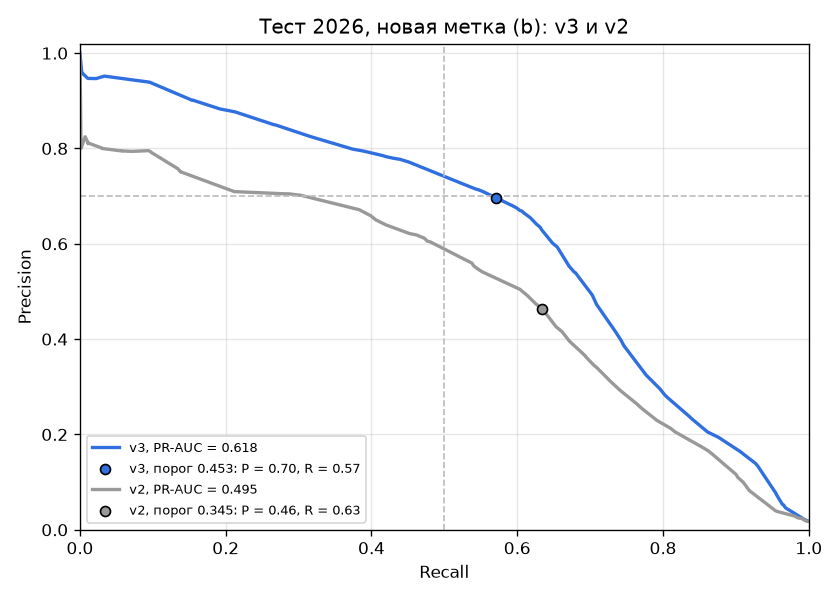
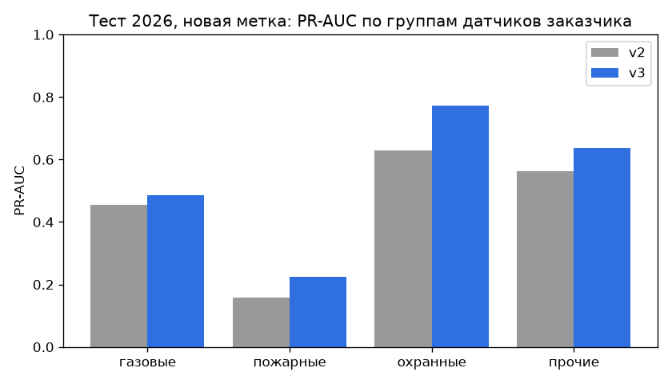
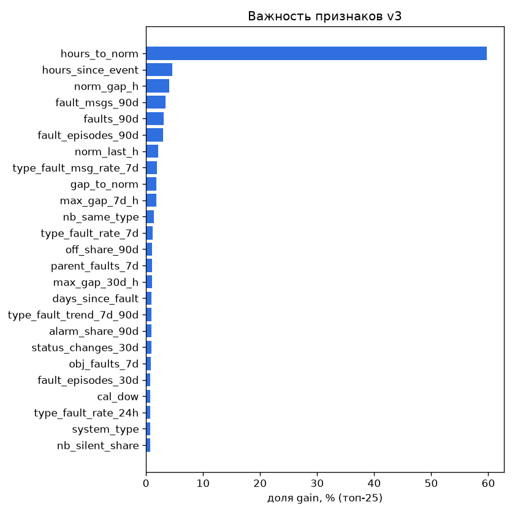
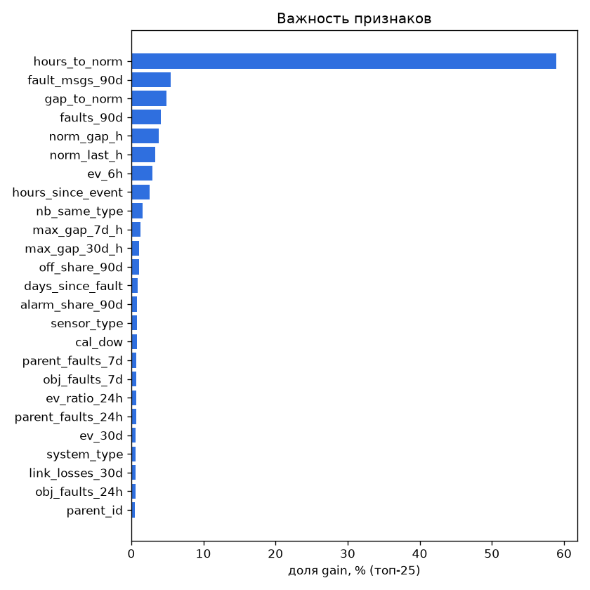
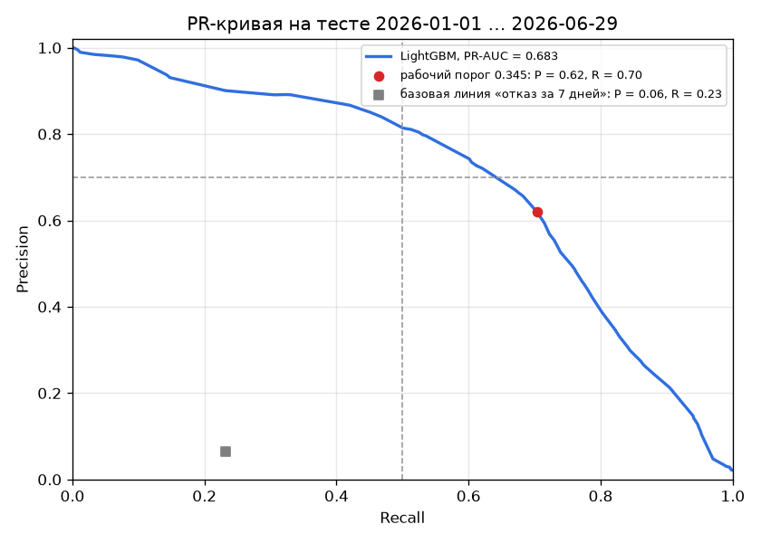
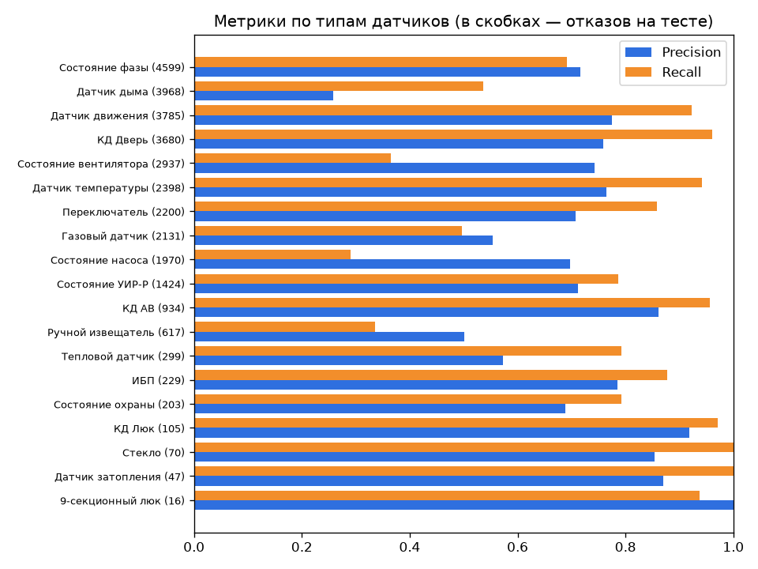

# ML: прогноз отказов датчиков на 24 часа — отчёт

Рабочая модель — **`lgbm-2026.09-v3`** (раздел «Версия 3»). Модель `lgbm-2026.09-v2` и её отчёт сохранены ниже, в разделе «Версия 2 (история)»; откат на v2 возможен. Все числа получены запуском кода из `/ml` (команды — в [`ml/README.md`](../ml/README.md)). Метрики теста: v3 — [`ml/artifacts/metrics_v3.json`](../ml/artifacts/metrics_v3.json), v2 — [`ml/artifacts/metrics.json`](../ml/artifacts/metrics.json). План, эксперименты и правило выбора v3 — [`ML_V3_PLAN.md`](ML_V3_PLAN.md), решения — [`ML_DECISIONS.md`](ML_DECISIONS.md), качество данных — [`DATA_QUALITY.md`](DATA_QUALITY.md).

# Версия 3 (`lgbm-2026.09-v3`)

## Итог

v3 построена по официальным ответам организаторов и заказчика (17–18.09, 23.09.2026; сводка — [`CUSTOMER_ANSWERS.md`](CUSTOMER_ANSWERS.md)). Главное изменение — не модель, а **данные и метка**:
- служебные значения больше не считаются показаниями;
- «01.01.1970» и аномальный газ стали отдельным видом отказа «Сбой значения»;
- плановые работы и отключения целых объектов (групповая тишина) и дни без данных не считаются отказами датчиков.

Модель выбрана по правилу, записанному до открытия теста. На тесте 2026 года (01.01–29.06, 1,48 млн срезов «канал × сутки», 26 440 отказов по новой метке) при пороге, выбранном на валидации, v3 даёт **Precision 0,696, Recall 0,571, F1 0,627, PR-AUC 0,618**. На той же метке v2 даёт P 0,464 / R 0,633 / F1 0,536 / PR-AUC 0,495. Лишних тревог в сутки у v3 36,9 против 108,6 у v2.

**Честные оговорки:**
- тестовый период просмотрен повторно — для v3 и для переоценки v2 на новой метке; основание — официальные ответы заказчика от 17–18.09 и 23.09. Результат v2 на старой метке (P 0,620 / R 0,703 / PR-AUC 0,683, тест открыт 25.09) сохранён и воспроизведён тем же скриптом;
- на **старой** метке v3 хуже v2 (PR-AUC 0,605 против 0,683): она не учится предсказывать групповую тишину, которую старая метка считала отказами.

## Что изменилось и почему

| Что | v2 | v3 | Основание |
|---|---|---|---|
| Служебные значения (-127, -3276, 255, 327,68, выход за физический диапазон) | входили в среднее и разброс как показания | вид значения `sentinel`: в показания не идут, считаются отдельно по окнам | таблица экспертов 17–18.09 |
| Значения-даты (`01.01.1970`, текущая дата) | выбрасывались при загрузке | сохраняются; `01.01.1970` — отказ «Сбой значения» | ответ заказчика 23.09 |
| Аномальный газ (вне [0; 100] % или ≥ 5 % без флага «тревожное») | обычное показание | «Сбой значения» | ответ заказчика 23.09 |
| Плановые работы / отключение объекта | размечались как пропадание связи | групповая тишина исключена из метки | график ППР АКМ 2026, проверка 25.09 |
| Дни без данных (06–09.04.2024, 14.08.2025, 01.06.2026) | тишина через простой считалась паузой датчика | паузы без часов простоя, срезы рядом с простоем исключены | ответ организаторов (сбой выгрузки) |
| 2019–2021 | не использовались | исключены явным правилом в коде | рекомендация организаторов (2021) |
| Признаки | 92 | 126: + служебные значения, газ ≥ 1 % в рабочее/нерабочее время и ≥ 5 %, «Обнаружен газ», эпизоды «Неисправен»/отключений/сбоев, восстановления связи («история ремонтов» из журнала), групповые отключения, доля молчащих соседей, отказы по типу датчика во всём парке и их тренд, «пульс» канала | |
| Обучение | с 2023, без весов | с 2023, веса свежих данных (полураспад 1 год) | сдвиг 2025–2026 |
| Вид отказа | — | `kind_probs`: вероятности «Пропадание связи», «Неисправен», «Отключено устройство», «Сбой значения» | общий ТЗ, раздел 6 |

«Неисправен», по ответу заказчика, — это факт потери связи с устройством. Поэтому модель в первую очередь предупреждает о потере связи: «пропадание связи» — это наблюдаемая тишина, «Неисправен» — сообщение системы о той же потере связи.

## Валидация (2-е полугодие 2025, до открытия теста)

Правило выбора ([`ML_V3_PLAN.md`](ML_V3_PLAN.md), раздел 5): сравнение только на новой метке; PR-AUC не хуже 0,680 и выше v2 на той же метке. Выбрана конфигурация с весами свежих данных: PR-AUC 0,681 против 0,617 у v2. Порог 0,453 — максимальный Recall при Precision ≥ 0,72.

| Метка | Модель | P | R | F1 | PR-AUC | P@20 / 50 / 100 | Тревог в сутки (лишних) |
|---|---|---|---|---|---|---|---|
| новая | v2 | 0,593 | 0,691 | 0,638 | 0,617 | 0,84 / 0,78 / 0,67 | 158 (64) |
| новая | **v3** | 0,731 | 0,575 | 0,644 | **0,681** | 0,93 / 0,86 / 0,71 | 106 (29) |
| старая | v2 | 0,729 | 0,702 | 0,715 | 0,755 | 0,97 / 0,93 / 0,82 | 153 (42) |
| старая | v3 | 0,802 | 0,529 | 0,637 | 0,697 | 0,94 / 0,89 / 0,77 | 105 (21) |

## Тест 2026 (01.01–29.06, открыт один раз для v3 — 26.09.2026 04:11)

| Метка | Модель | P | R | F1 | PR-AUC | P@20 / 50 / 100 | Эпизоды с предупреждением за 1–24 ч | Медианное упреждение, ч | Тревог в сутки (лишних) |
|---|---|---|---|---|---|---|---|---|---|
| **новая** | v2 | 0,464 | 0,633 | 0,536 | 0,495 | 0,80 / 0,72 / 0,61 | 61,5 % | 10,5 | 202,7 (108,6) |
| **новая** | **v3** | **0,696** | 0,571 | **0,627** | **0,618** | **0,91 / 0,83 / 0,69** | 55,4 % | 10,2 | **121,7 (36,9)** |
| старая | v2 | 0,620 | 0,703 | 0,659 | 0,683 | 0,96 / 0,90 / 0,77 | 68,5 % | 10,7 | 199,2 (75,7) |
| старая | v3 | 0,746 | 0,497 | 0,597 | 0,605 | 0,90 / 0,83 / 0,71 | 48,2 % | 10,3 | 116,9 (29,7) |

Базовая линия «был отказ за 7 дней — будет снова» на новой метке: P 0,063 / R 0,227.

### Метрики с точки зрения диспетчера

Организаторы: «пользователь получил прогноз, а потом увидел, наступило ли событие». Как читать, на тесте по новой метке:
- из 20 самых рискованных датчиков за сутки отказывают 18 (P@20 = 0,91; у v2 — 16);
- из 100 — 69;
- 55 % отказов получают предупреждение не меньше чем за час и не больше чем за сутки до начала, медианное упреждение — 10 ч;
- диспетчер получает ≈ 122 тревоги в сутки на ≈ 8 тыс. активных датчиков. Из них ≈ 85 подтверждаются, ≈ 37 — лишние (у v2 — ≈ 203 тревоги, из них 109 лишних).

Ползунок порога (тест, новая метка): 0,30 → P 0,634 / R 0,631 / 148 тревог в сутки; **0,45 (рабочий) → 0,696 / 0,571 / 122**; 0,50 → 0,713 / 0,547 / 114; 0,60 → 0,777 / 0,439 / 84; 0,70 → 0,799 / 0,374 / 70.

### По группам датчиков заказчика (тест, новая метка)

| Группа | Отказов | v2: P / R / PR-AUC | v3: P / R / PR-AUC | Тревог в сутки v2 → v3 |
|---|---|---|---|---|
| газовые | 1 972 | 0,486 / 0,480 / 0,456 | 0,645 / 0,325 / **0,486** | 11,0 → 5,6 |
| пожарные (дым, тепловые, ручные, УИР-Р) | 3 660 | 0,150 / 0,442 / 0,158 | 0,453 / 0,251 / **0,224** | 60,6 → 11,4 |
| охранные (КД, движение, люки, стекло) | 7 120 | 0,581 / 0,895 / 0,630 | 0,710 / 0,808 / **0,773** | 61,6 → 45,5 |
| прочие | 13 688 | 0,630 / 0,570 / 0,564 | 0,738 / 0,568 / **0,636** | 69,6 → 59,2 |

### По видам отказа (тест, новая метка, Recall v2 → v3)

- пропадание связи — 0,833 → 0,749 (19 950);
- «Неисправен» — 0,020 → 0,019 (5 111);
- «Отключено устройство» — 0,006 → 0,001 (1 298);
- **«Сбой значения» — 0,123 → 0,568** (81).

Голова видов: при условии, что отказ будет, верный вид назван первым в 93,5 % случаев (базовый уровень — 75,5 %). Пропадание связи — 0,996, «Неисправен» — 0,931, «Сбой значения» — 0,914, «Отключено устройство» — 0,013: в 2026 году этот вид вырос с 0,1–0,8 тыс. до 5,3 тыс. сообщений, и модель его почти не отличает от «Неисправен».

### По типам датчиков (тест, новая метка)

Выше всего — датчики температуры (P 0,81 / R 0,90), КД АВ (0,83 / 0,94), КД Дверь (0,74 / 0,88), стекло и затопление. Ниже всего — вентиляторы (R 0,17), насосы (R 0,24), дым (P 0,44 / R 0,19), ручные извещатели (0,39 / 0,27). Полная таблица — `by_sensor_type` в `metrics_v3.json` и на экране «Качество модели».

## Обоснование целевых метрик

Плановые значения **Precision > 0,7 и Recall > 0,5** организаторы назвали значениями «по умолчанию, не жёсткими»: снизить их можно, обоснованно. v3 на тесте даёт **Recall 0,571 > 0,5** и **Precision 0,696** — на 0,004 ниже плановой. При пороге 0,5 (ползунок) — P 0,713 / R 0,547, обе цели выполнены. Но порог по тесту мы не выбирали, рабочим остаётся порог валидации. Почему на этих данных достигнуто столько:

1. **Нет подтверждённых инцидентов.** Журналов ОДС, решений диспетчеров и истории ремонтов не будет (модератор, 23.09). Метка строится из самого журнала, и её шум ограничивает Precision сверху: часть «отказов» — плановые работы, часть «ложных тревог» — настоящие проблемы, которые не дошли до события-отказа.
2. **«Неисправен» — это потеря связи с устройством** (ответ заказчика), а не код поломки. Эти сообщения идут без заметных предвестников: базовая частота — 0,3 % срезов, и даже у каналов, где «Неисправен» уже повторялся (lift ×58), вероятность в следующие 24 ч — около 2,7 %. Recall по «Неисправен» и «Отключено устройство» ≈ 0,02 — предел этих данных, а не модели.
3. **Служебные значения и значения-даты** в v2 искажали признаки и терялись. В v3 они размечены и дали новый предсказуемый вид отказа: «Сбой значения», Recall 0,57.
4. **Плановые работы.** Групповая тишина — 15–17 % пропаданий связи в 2023–2025 годах и треть сообщений «Неисправен» 2025 года. Она выглядит как отказ, но им не является. Исключить её из метки честнее, но теряются «лёгкие» положительные примеры, поэтому Recall ниже, чем у v2 на старой метке.
5. **Сдвиг 2025–2026.** Рост сообщений «Неисправен» дали несколько каналов (объект 5122 — плановое отключение 55 газовых датчиков в ноябре 2025; 2 «дребезжащих» термодатчика объекта 5343 в декабре), а «Отключено устройство» в 2026 году выросло в 7–50 раз. Precision на тесте ниже валидации (0,696 против 0,731), но разрыв меньше, чем у v2 (0,620 против 0,729).
6. **Редко шлющие датчики** (дым, ручные извещатели): личная норма паузы у них — почти максимум пауз за 30 дней, и любая тишина дольше неё размечается как отказ. v3 снизила у пожарных лишние тревоги в 5 раз (60,6 → 11,4 в сутки), но Recall у них 0,25.

Для диспетчера важнее, что из 20 первых в списке датчиков 18 действительно отказывают (P@20 = 0,91), а лишних тревог в сутки втрое меньше, чем у v2. Анонс задачи говорит, что «до 80 % вызовов могут оказываться ложными»; у v3 ложных — 30 % при рабочем пороге и 9 % в топ-20.

## Ограничения v3

1. Precision на тесте — 0,696 при рабочем пороге (цель — 0,7 «по умолчанию»).
2. Статусные отказы («Неисправен», «Отключено устройство») почти не предсказываются (раздел выше, п. 2).
3. Правило групповой тишины подобрано по обучающим данным и проверено по датам графика ППР 2026 — совпадения по трём объектам с точностью до дня. Однозначного соответствия «Объект N» графика и наших объектов нет.
4. Вентиляторы и насосы: Recall 0,17–0,24 — отказ агрегата часто не виден в журнале заранее.
5. Тест просмотрен дважды (v2 — 25.09, v3 — 26.09); v3 выбиралась по правилу на валидации, порог по тесту не подбирался.

# Версия 2 (`lgbm-2026.09-v2`, история)

Ниже — отчёт v2 без изменений (тест открыт 25.09.2026, старая метка).

### Итог v2 в одном абзаце

На тесте 2026 года (01.01–29.06, 1,48 млн срезов «канал × сутки», 31 612 отказов) при пороге, выбранном на валидации 2025 года, модель даёт **Precision 0,620, Recall 0,703, F1 0,659, PR-AUC 0,683**. Базовая линия «был отказ за 7 дней — будет снова» — Precision 0,064, Recall 0,233. **Цель ТЗ (Precision > 0,7 и Recall > 0,5) выполнена по Recall и не выполнена по Precision.** PR-кривая на тесте проходит через целевую зону (например, порог 0,55 → P 0,742 / R 0,601), но порог выбирался на валидации, где при P ≥ 0,72 получился 0,345; на тесте при нём точность ниже — распределение 2026 года отличается от второго полугодия 2025. Порог по тесту не подбирался. Precision@20 за сутки — 0,963, Precision@50 — 0,897, Precision@100 — 0,769; медианное упреждение верной тревоги — 10,7 ч.

### Постановка

- Объект — канал датчика (`ид_канала_данных`). Обучение — на срезах «канал × сутки» в 00:00, прогноз в работе — на любой час.
- Метка `y = 1`, если у канала есть отказ в интервале (T, T + 24 ч]. Отказ — одно из трёх:
  1. событие «Неисправен»;
  2. событие «Отключено устройство»;
  3. пропадание связи: пауза между сообщениями длиннее личной нормы канала — 99-го перцентиля его пауз за 30 дней, но не меньше 6 ч. Момент отказа — последнее сообщение + норма.
- Названия статусов-отказов выбраны по реальному журналу, а не по `справочник_состояний.csv`: в справочнике «тип датчика» не совпадает с типами каналов (например, «Обнаружен газ» записан у «Датчик температуры»). В журнале «Неисправен» — 1,49 млн событий у 4 821 канала, «Отключено устройство» — 8,8 тыс. у 3 178; оба общие для многих типов датчиков. «Обесточен», «Неопределен», «Не замкнут», «Обнаружен дым/газ/движение», «Затоплен» — состояния среды или питания, они стали признаками, а не меткой.
- Часы, в которые связь одновременно теряют ≥ 100 каналов (172 часа, ≈ 11 % пропаданий связи), — сбои сбора данных, из разметки исключены.
- Только новые отказы: срезы с отказом в (T − 72 ч, T] исключены. Каналы без событий за 30 дней до T исключены.
- Доля положительных: обучение 1,98 %, валидация 2,10 %, тест 2,14 %. Около 80 % отказов — пропадания связи.

### Данные

313,5 млн строк за 2019-01-01 … 2026-06-30 → 312,5 млн после чистки (значения-даты, дубли, повтор заголовка). Журнал 2026 года заканчивается 30.06.2026, поэтому тест — первое полугодие 2026, а пример из ТЗ `at=2026-08-01T12:00` на реальных данных пуст: «машина времени» работает для 01.01–30.06.2026. Сутки 01.08.2026 из `журнал_событий_пример.csv` совпали с описанием ТЗ (169 993 строки, 1 241 канал, 105 «Неисправен» у 69 каналов). Подробности — в [`DATA_QUALITY.md`](DATA_QUALITY.md).

### Признаки (92)

Все признаки считаются только по событиям строго до T: почасовые агрегаты по каналу → кумулятивные суммы → окно [T − w, T) как разность кумулятивов (DuckDB, ASOF JOIN, без циклов по каналам).

| Группа | Признаки | Окна |
|---|---|---|
| Активность | число сообщений, отношение к норме канала за 30 дней, часов с последнего сообщения, личная норма паузы, текущая пауза к норме, **часов до превышения нормы**, макс. пауза | 1 ч, 6 ч, 24 ч, 7 д, 30 д, 90 д |
| Статусы | сообщений «Неисправен» и «Отключено устройство», доли «Неопределен», «Обесточен», тревожных, смены статуса (дребезг), статусных сообщений; отказов и пропаданий связи за период, дней с последнего отказа | 1 ч … 90 д |
| Числовые (газ, температура) | число показаний, среднее, разброс, доля одинаковых подряд (залипание) | 24 ч, 7 д, 30 д |
| Соседи | отказы других датчиков объекта и родительского объекта, доля «Обесточен» у фаз объекта, отклонение активности, показаний и доли «Неопределен» от медианы однотипных датчиков объекта, число однотипных соседей | 24 ч, 7 д |
| Статические | тип датчика, система, родительский объект, уровни и глубина тега, метки ПК / АНС / щит / ВШ | — |
| Календарь | час, день недели, месяц, выходной | — |

Главный признак — `hours_to_norm` (56 % суммарного gain): сколько часов осталось до того, как текущая тишина канала превысит его личную норму. Норма берётся та же, что в разметке (по 30 дням до дня последнего сообщения), тишина — по событиям до T, поэтому признак известен в момент прогноза. Он превращает часть задачи «пропадание связи» в вопрос «успеет ли канал выйти на связь до истечения нормы». Без него (модель v1) валидация давала Recall 0,225 при Precision 0,72; с ним (v2) — 0,702. Утечку проверяли по сырым событиям конкретного среза (канал 197003, 02.07.2025: последнее сообщение 27.06 13:50, норма 119,4 ч посчитана по данным до 26.06, отказ в 13:11:51, следующее сообщение — 14:03).

### Модель и валидация

- Разбиение только по времени, зазор — сутки: обучение 2023-01-01 … 2025-06-29 (6,13 млн срезов, 121 тыс. отказов), валидация 2025-07-01 … 2025-12-30 (1,38 млн, 29 тыс.), тест 2026-01-01 … 2026-06-29 (1,48 млн, 31,6 тыс.).
- LightGBM: вес положительного класса √(neg/pos) ≈ 7, 127 листьев, learning rate 0,03, ранняя остановка по average precision на валидации (369 деревьев).
- Изотоническая калибровка на валидации; индекс здоровья `health = round(100·(1 − p))`: ≥ 80 норма, 50–79 внимание, 20–49 риск, < 20 критично.
- Порог — максимальный Recall при Precision ≥ 0,72 на валидации: **0,345** (валидация: P 0,729, R 0,702, PR-AUC 0,755).
- Тест открыт один раз (`data/models/lgbm-2026.09-v2/TEST_OPENED`). Скрипт оценки был перезапущен ещё раз только для исправления строки рабочего порога в таблице ползунка (она считалась по округлённому порогу); модель, порог и все метрики не изменились — сравнение с первым запуском сохранено в `metrics_first_run.json`.

### Метрики на тесте 2026

| | Precision | Recall | F1 | PR-AUC |
|---|---|---|---|---|
| **LightGBM, порог 0,345** | **0,620** | **0,703** | **0,659** | **0,683** |
| Базовая линия «отказ за 7 дней» | 0,064 | 0,233 | 0,100 | — |
| Цель ТЗ | > 0,7 | > 0,5 | | |

- Precision@K (среднее по суткам): P@20 = 0,963, P@50 = 0,897, P@100 = 0,769.
- Медианное упреждение верной тревоги: 10,7 ч.
- Recall по видам отказа: пропадание связи — 0,893 (24 792 отказа), «Неисправен» — 0,017 (5 506), «Отключено устройство» — 0,008 (1 314).
- Тревог в сутки при рабочем пороге — 199 (из них верных 124, лишних 76) на ≈ 8 тыс. активных каналов.

### По типам датчиков

| Тип датчика | Отказов | Precision | Recall | F1 | PR-AUC |
|---|---|---|---|---|---|
| Состояние фазы | 4 599 | 0,716 | 0,691 | 0,703 | 0,708 |
| Датчик дыма | 3 968 | 0,258 | 0,536 | 0,348 | 0,239 |
| Датчик движения | 3 785 | 0,775 | 0,922 | 0,842 | 0,901 |
| КД Дверь | 3 680 | 0,759 | 0,960 | 0,848 | 0,892 |
| Состояние вентилятора | 2 937 | 0,743 | 0,365 | 0,489 | 0,473 |
| Датчик температуры | 2 398 | 0,764 | 0,942 | 0,844 | 0,898 |
| Переключатель | 2 200 | 0,708 | 0,859 | 0,776 | 0,817 |
| Газовый датчик | 2 131 | 0,553 | 0,497 | 0,524 | 0,554 |
| Состояние насоса | 1 970 | 0,697 | 0,290 | 0,409 | 0,412 |
| Состояние УИР-Р | 1 424 | 0,712 | 0,787 | 0,748 | 0,675 |
| КД АВ | 934 | 0,861 | 0,956 | 0,906 | 0,930 |
| Ручной извещатель | 617 | 0,501 | 0,335 | 0,402 | 0,206 |
| Тепловой датчик | 299 | 0,572 | 0,793 | 0,665 | 0,721 |
| ИБП | 229 | 0,785 | 0,878 | 0,829 | 0,816 |
| Состояние охраны | 203 | 0,688 | 0,793 | 0,737 | 0,792 |
| КД Люк | 105 | 0,919 | 0,971 | 0,944 | 0,954 |
| Стекло | 70 | 0,854 | 1,000 | 0,921 | 0,939 |
| Датчик затопления | 47 | 0,870 | 1,000 | 0,931 | 0,948 |
| 9-секционный люк | 16 | 1,000 | 0,938 | 0,968 | 0,939 |

### Порог → Precision, Recall, тревог в сутки (ползунок в интерфейсе, тест)

| Порог | Precision | Recall | Тревог в сутки | Верных | Лишних |
|---|---|---|---|---|---|
| 0,05 | 0,306 | 0,841 | 482 | 148 | 335 |
| 0,10 | 0,440 | 0,780 | 312 | 137 | 174 |
| 0,20 | 0,568 | 0,722 | 223 | 127 | 96 |
| 0,30 | 0,596 | 0,714 | 210 | 125 | 85 |
| **0,345 (рабочий)** | **0,620** | **0,703** | **199** | **124** | **76** |
| 0,40 | 0,671 | 0,670 | 175 | 118 | 58 |
| 0,50 | 0,721 | 0,620 | 151 | 109 | 42 |
| 0,60 | 0,796 | 0,536 | 118 | 94 | 24 |
| 0,70 | 0,804 | 0,525 | 115 | 92 | 22 |
| 0,80 | 0,867 | 0,420 | 85 | 74 | 11 |
| 0,90 | 0,892 | 0,325 | 64 | 57 | 7 |
| 0,95 | 0,937 | 0,143 | 27 | 25 | 2 |

Полная таблица с шагом 0,05 загружается в `model_thresholds` и отдаётся `GET /api/model/thresholds`.

### Прогнозы для интерфейса

- `predict(at)`: `python -m model.predict --at 2026-06-15T12:00` — все 7 745 активных каналов за 34 с (цель ТЗ — меньше минуты).
- Почасовые прогнозы за 01.01–30.06.2026 — `data/predictions/<месяц>.parquet`, формат бэкенда: `channel_id, at, horizon_h = 24, prob, health, risk_level, top_factors, model_version` + исход (`happened`, `fault_at`, `fault_kind`) по реальным событиям следующих 24 ч.
- `top_factors` — для прогнозов уровня «внимание» и выше (p ≥ 0,2, ≈ 4 % строк) три признака с наибольшим положительным вкладом SHAP, в виде `{feature, value, norm, phrase}`; фраза на русском, норма — медиана признака по типу датчика на обучении: «Часов до превышения личной нормы тишины: 2,6 (обычно 130,6)». У «нормы» список пустой: TreeSHAP по 369 глубоким деревьям стоит 1–4 мс на строку, на 38,8 млн почасовых строк это недопустимо долго.
- В PostgreSQL загружено 11,0 млн прогнозов (каждый час за июнь, каждые 6 ч за январь–май) и 10,8 млн исходов. `GET /api/predictions?at=2026-06-15T12:00:00` отдаёт 7 745 каналов в форме примера из ТЗ; первый — «ОД АВ ПК9» (датчик движения, объект Пси), p = 0,991, critical, отказ случился в 14:37:22.

### Ограничения и честные оговорки

1. **Precision на тесте ниже цели** (0,620 < 0,7). Основной источник лишних тревог — датчики дыма (P 0,258 на 3 968 отказах) и газовые датчики (0,553). Если заказчику важнее точность, рабочий порог можно поднять ползунком (0,5 → P 0,721 / R 0,620 на тесте), но это решение по данным теста, и в модель оно не зашито.
2. **Модель почти не предсказывает «Неисправен» и «Отключено устройство»** (Recall 0,017 и 0,008). Качество держится на пропаданиях связи. Статусные отказы в журнале возникают без заметных предвестников в доступных признаках; нужен журнал диспетчеров и реестр ремонтов, которых в данных нет.
3. **Пропадание связи частично «механическое»**: если канал уже молчит почти всю личную норму, отказ очень вероятен. Для диспетчера это всё равно полезный сигнал («датчик молчит 106 ч при норме 119 ч»), но это не предсказание поломки по косвенным признакам.
4. Для датчиков, редко шлющих сообщения (дым, ручные извещатели), личная норма — это почти максимум пауз за 30 дней; любая более долгая тишина размечается как отказ, хотя может быть просто отсутствием событий. Отсюда низкая точность по дыму.
5. Каналы с отказом в последние 72 ч в обучении и метриках не участвуют, но прогнозы для них в интерфейсе есть; для них модель работает вне обучающего распределения.
6. Отсечка массовых сбоев (≥ 100 каналов за час) выбрана по распределению, без подтверждения от заказчика.
7. Данные после 30.06.2026 отсутствуют; сутки 01.08.2026 из примера не использовались для оценки (нет истории для признаков).

### Что можно улучшить

- Отдельная модель или порог для редких событийных датчиков (дым, извещатели) и минимальная норма паузы для них больше 6 ч.
- Признаки периодичности сообщений (у многих каналов есть «пульс») — снизят ложные тревоги по связи.
- Для статусных отказов — история ремонтов и журнал диспетчеров, признаки по соседним каналам того же щита/тега.
- Переобучение на 2023-01 … 2025-12 с валидацией на последних месяцах 2025 — чтобы уменьшить сдвиг между валидацией и тестом.

### Воспроизводимость

См. [`ml/README.md`](../ml/README.md): 10 команд от CSV до PostgreSQL с временем каждого шага (всего ≈ 4,5 ч на этой машине, из них ≈ 2,5 ч — почасовые признаки и прогнозы на полгода).
