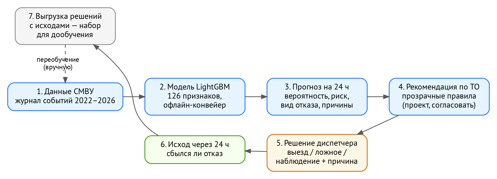
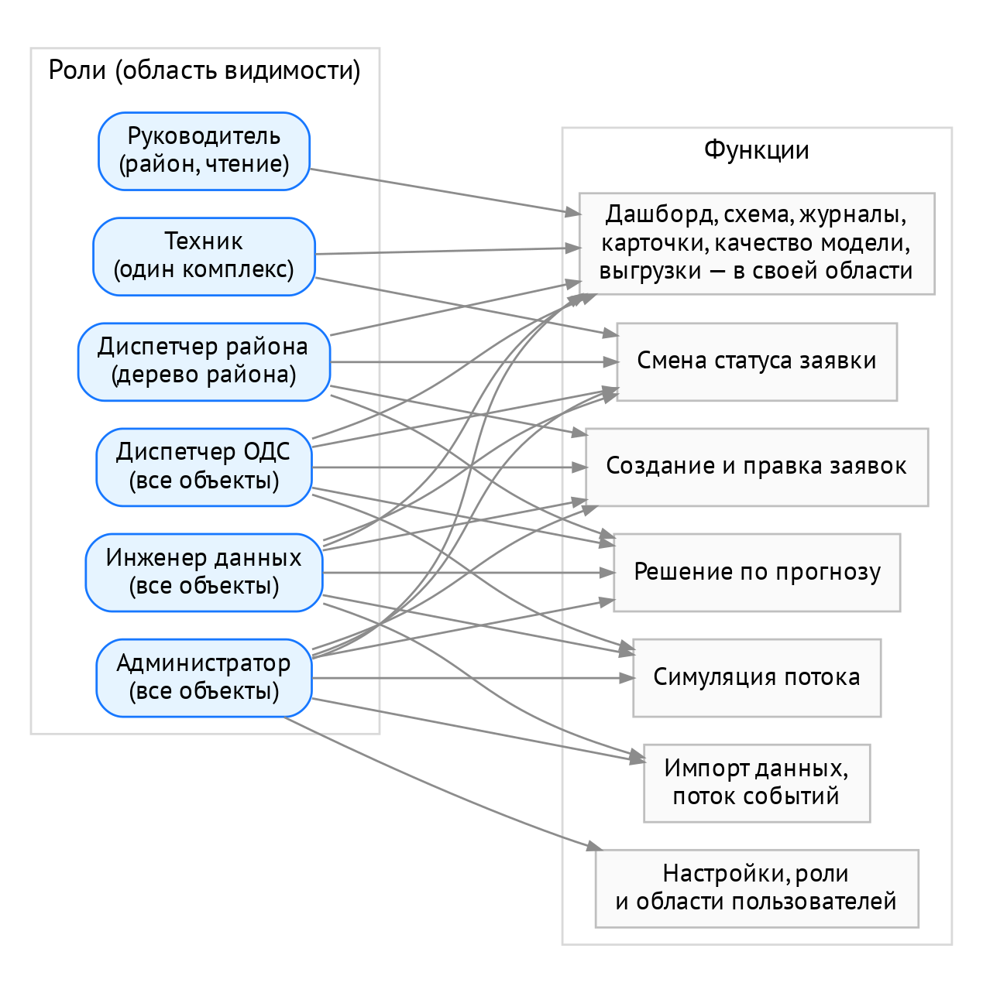
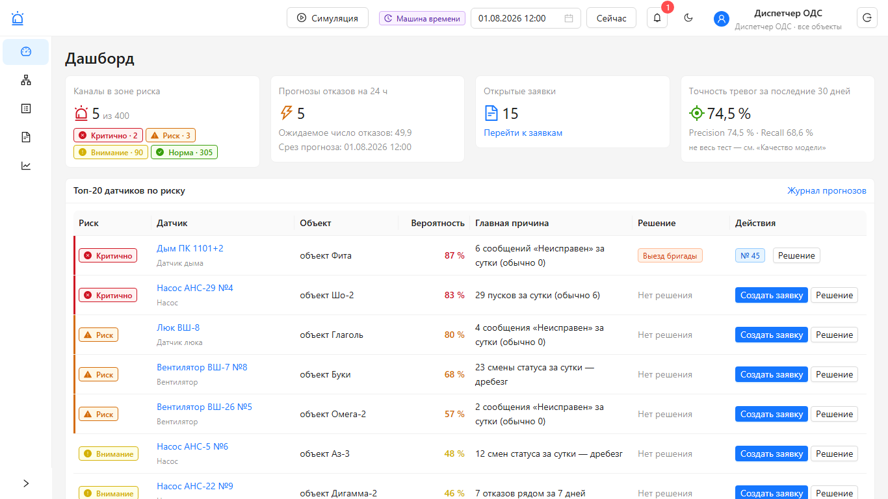
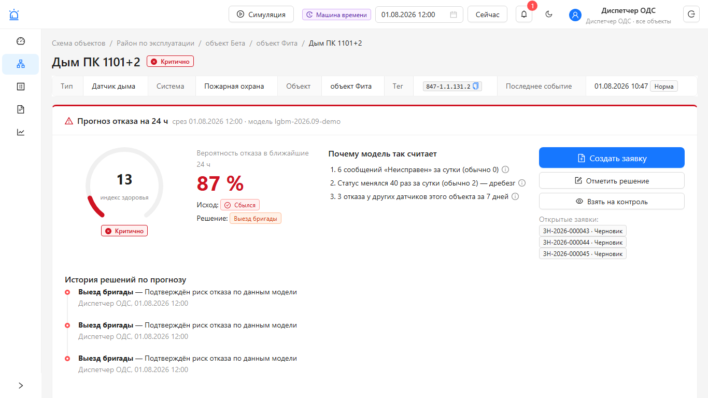
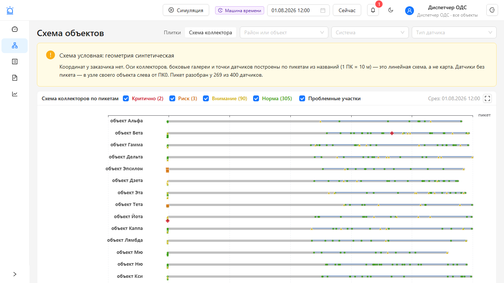
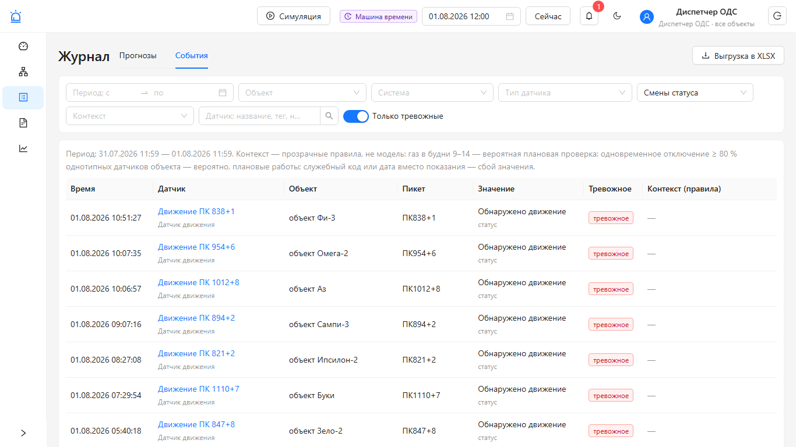
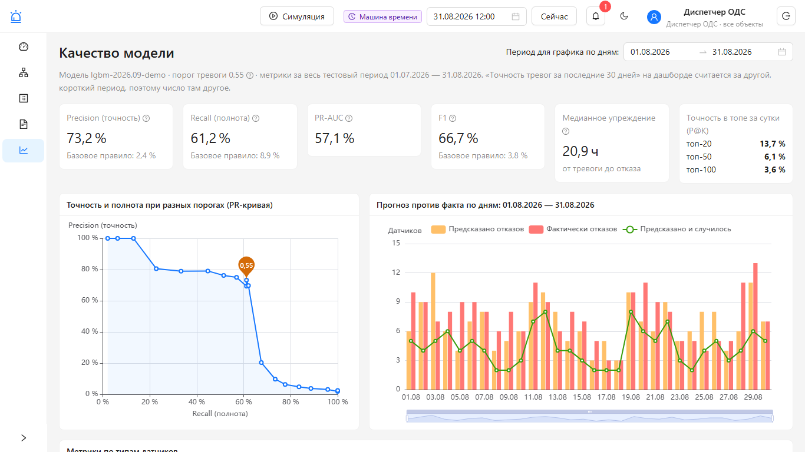
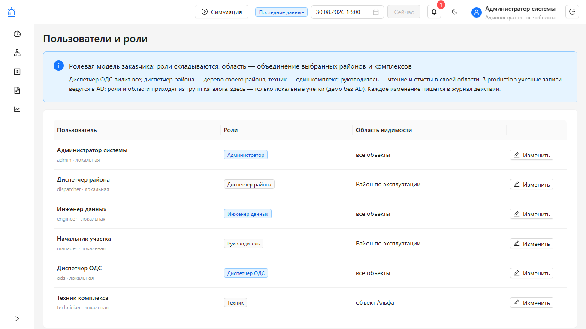
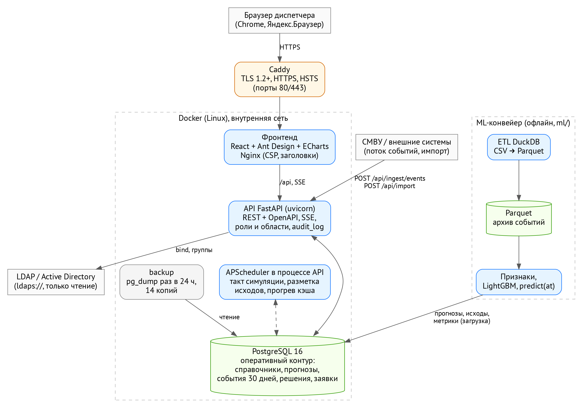
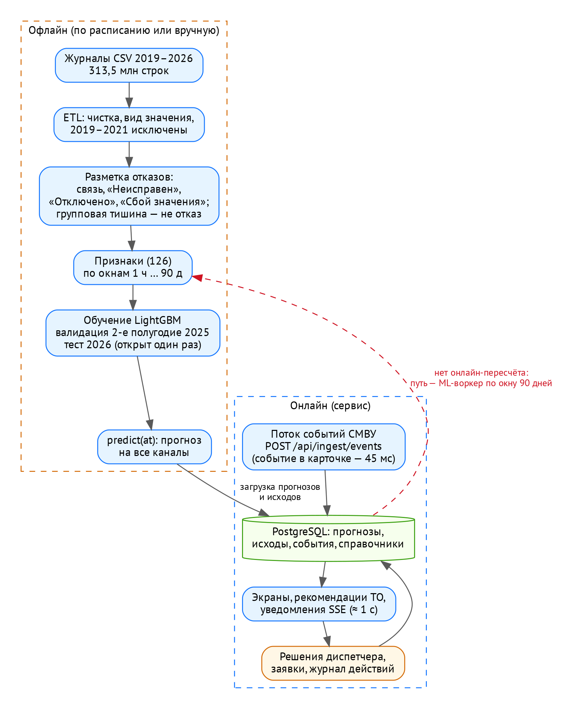

# Кратко о решении

**Проблема.** В подземных коллекторах Москвы тысячи датчиков — газа, дыма, температуры, дверей и люков, насосов,
вентиляторов, питания. Датчики отказывают: теряют связь, сообщают «Неисправен», присылают технические коды вместо
показаний. Каждая такая тревога — потенциальный выезд бригады. Анонс задачи: *«до 80 % вызовов могут оказываться
ложными»*.

**Что делает сервис.** Каждый час для каждого датчика он оценивает вероятность отказа в ближайшие **24 часа**,
называет вероятный вид отказа (потеря связи, «Неисправен», «Отключено устройство», «Сбой значения») и три причины
простыми словами. Он предлагает, что сделать (рекомендация по техническому обслуживанию — ТО), и одним нажатием
готовит черновик заявки. Диспетчер отмечает решение (выезд, ложное срабатывание или наблюдение), сервис сам
отмечает, сбылся ли прогноз, и копит эти пары «решение — исход» для дообучения модели.

**Для кого.** Роли — по ответу заказчика. Диспетчер объединённой диспетчерской службы (ОДС) видит все объекты,
диспетчер района — дерево своего района, техник — один комплекс, руководитель — отчёты своей области. Есть также
инженер данных и администратор. Роли складываются, данные чужих объектов сервер не выдаёт.

**Ключевые результаты** (модель `lgbm-2026.09-v3`, честный тест на первом полугодии 2026 года, который модель не
видела при обучении):

| Показатель | Значение | Что это значит для диспетчера |
|---|---|---|
| Precision (точность тревог) | **0,696** | из 100 тревог ≈ 70 заканчиваются реальным отказом за 24 ч |
| Recall (полнота) | **0,571** | предупреждение получают 57 % отказов |
| P@20 за сутки | **0,91** | из 20 самых рискованных датчиков суток отказывают 18 |
| Тревог в сутки (из них лишних) | **≈ 122 (≈ 37)** | у предыдущей версии v2 на той же метке — ≈ 203 (≈ 109): лишних втрое меньше |
| Вид отказа назван верно | **93,5 %** | при условии, что отказ будет (базовый уровень — 75,5 %) |
| Медианное упреждение | **10 ч** | тревога приходит заранее, а не в момент отказа |

Table: Ключевые результаты модели v3 на тесте 2026 года (источник — раздел 7)

Плановые значения организаторов — Precision > 0,7 и Recall > 0,5 («по умолчанию, не жёсткие»). Recall выполнен,
Precision ниже плана на 0,004. Почему на этих данных столько — раздел 8.

{width=100%}

**Что посмотреть за 5 минут.** Раздел 11: `docker compose up --build`, затем открыть `http://localhost:8080` и
войти кнопкой «Диспетчер ОДС». Демо-данные синтетические. Чтобы увидеть **реальные прогнозы v3 и их исходы**,
загрузите срез реальных данных за июнь 2026 года одной командой (раздел 11.3, архив — [ссылка на архив среза]).
Экран «Качество модели» показывает метрики теста, журнал — сбылся ли каждый прогноз.

**Честно о границах.** Онлайн-пересчёта прогноза моделью по входящему потоку нет: прогнозы считает офлайн-конвейер
(раздел 4.4). Статусные отказы «Неисправен» и «Отключено устройство» почти не предсказываются — это предел данных
(раздел 8). Правила ТО — проект, требуют согласования со специалистами эксплуатации. Геометрия схемы коллектора
синтетическая, решения диспетчера в демо смоделированы, демо-данные синтетические — всё это помечено в интерфейсе.

# Соответствие общему ТЗ

## Сверка по разделам 4–13 общего ТЗ

Статусы: **выполнено**, **частично** (что именно не сделано и почему), **нет** (почему). Направление команды —
«Отказ датчика»; требования, относящиеся к другим направлениям (прогноз пожаров, подтоплений, проникновений),
отмечены прямо. Таблицы собраны из файла проекта `docs/TZ_COVERAGE.md` (он же — в репозитории).

<!--TZ_COVERAGE-->

## Требования раздела 14 к решению и документации

| Требование раздела 14 | Где в документе и в проекте |
|---|---|
| Методы доступны и подробно описаны | раздел 5 «Данные и методы обработки»; код ML — `ml/`, отчёт — `docs/ML_REPORT.md` |
| Перечень всех библиотек и компонентов | раздел 14 (прямые зависимости, образы, инструменты) и приложение В (все пакеты с версиями и лицензиями) |
| Отдельный сервис, может стать самостоятельной ИС или её компонентом | разделы 4 и 12: автономный сервис в Docker, REST API и OpenAPI, интеграции только нужные |
| Комментарии в сложных местах | код: docstring у модулей (`app/access.py`, `app/geo/pickets.py`, `app/event_context.py`, `app/notifications.py`, `ml/features/*`), комментарии «почему так»; раздел 15.2 — где что лежит |
| Используемые методы обработки данных | раздел 5, находки — раздел 6 |
| Условия и ограничения внутри решения | разделы 8 и 9 (с цитатами ответов организаторов и заказчика) |
| Инструкции по компиляции, сборке и установке | раздел 11 (demo, срез для экспертов, production, без Docker, ML с нуля, тесты) |
| Функциональная и компонентная архитектура | разделы 3 и 4 (рисунки 2–4) |
| Открытый и неоткомпилированный исходный код без обфускации | исходный код на Python и TypeScript в репозитории целиком; сборка фронтенда — из исходников командой `npm run build`, минификация только в итоговом образе |
| 149-ФЗ и 152-ФЗ | раздел 10 |

Table: Чек-лист раздела 14 общего ТЗ

# Функциональная архитектура

## Роли и что они делают

Ответ заказчика (цитата): *«"диспетчер" подразделения эксплуатации видит дерево своего района; "диспетчер ОДС"
(центральная диспетчерская) видит всё; "техник" видит один комплекс; "администратор" ИС. Роли складываются, группы
по комплексам задают область видимости»*. Руководитель подразделения — из общего ТЗ (раздел 3), инженер данных —
роль прототипа для загрузки данных и показа симуляции.

| Роль | Область видимости | Что делает |
|---|---|---|
| Диспетчер ОДС | все объекты | смотрит риски, принимает решения по прогнозам, создаёт заявки, запускает симуляцию для показа |
| Диспетчер района | дерево своего района | решения по прогнозам и заявки в своём районе |
| Техник | один комплекс | видит свой комплекс, меняет статус заявок (взял в работу, выполнил) |
| Руководитель | свой район | только чтение и выгрузки (отчёты) |
| Инженер данных | все объекты | импорт справочников и событий, поток событий, симуляция, решения и заявки |
| Администратор | все объекты | всё перечисленное, настраиваемые параметры, роли и области пользователей |

Table: Роли заказчика и их права

Роли складываются: права пользователя — объединение прав его ролей, а область — объединение выбранных районов и
комплексов. Проверка выполняется **на сервере при каждом запросе**: интерфейс только прячет недоступные кнопки.
Чужой объект по прямой ссылке сервер показывает как несуществующий (ответ 404). Подробно — раздел 10.

{width=95%}

## Экраны

| Экран | Что на нём | Для кого |
|---|---|---|
| Дашборд | датчики в зоне риска, прогнозы отказов на 24 ч, открытые заявки, точность за 30 дней; топ-20 датчиков по риску; ползунок чувствительности тревог; мини-схема объектов; лента новых переходов в «Критично» | все роли |
| Схема объектов | дерево «район → объект-комплекс → подобъект» плитками с раскраской по максимальному риску; вкладка «Схема коллектора» — линейная схема по пикетам (раздел 5.9) | все роли |
| Карточка датчика | вероятность, индекс здоровья, вид отказа, три причины языком диспетчера, рекомендация по ТО, решение, заявка, графики за 30 дней, история прогнозов и решений, события за 7 дней | все роли |
| Журнал | вкладка «Прогнозы» — прогнозы с решениями, исходами и заявками; вкладка «События» — тревожные события и смены статуса с контекстом; выгрузка XLSX (прогнозы — и XML) | все роли |
| Заявки | заявки со статусами, печать, «Рекомендованные работы» — черновики заявок по правилам ТО | все роли, изменения — по правам |
| Качество модели | метрики теста, PR-кривая, «прогноз против факта» по дням, метрики по типам, группам заказчика и видам отказа, сравнение с v2 | все роли |
| Пользователи и роли | роли и области локальных учётных записей | администратор |
| Шапка | «машина времени» (любой момент в прошлом), симуляция потока, колокольчик уведомлений, тёмная тема, роль и область пользователя | все роли |

Table: Экраны интерфейса

{width=100%}

{width=100%}

{width=100%}

{width=100%}

{width=100%}

{width=100%}

## Пользовательские пути (общий ТЗ, раздел 12)

Команда выбрала направление «Отказ датчика». Поэтому сценарии раздела 12 («пожар», «подтопление») пройдены для
прогнозируемого отказа датчика.

| Шаг сценария ТЗ | Как в сервисе |
|---|---|
| 1. Анализ данных в автоматическом режиме | офлайн-конвейер `ml/` считает признаки по журналу событий и прогнозы на каждый час; групповая тишина объекта (плановые работы) не считается отказом |
| 2. Формирование прогноза с вероятностью и предупреждением | вероятность, индекс здоровья, уровень риска, вид отказа, три причины |
| 3. Уведомление на дашборд: вероятность, горизонт, локация | всплывающее уведомление со звуком и колокольчик — только о **новых** переходах в «Критично»; путь «район → объект → подобъект», пикет |
| 4. Верификация | карточка: графики, события за 7 дней с контекстом («вероятная плановая проверка», «групповое отключение»), соседи по объекту в рекомендации; интеграции с камерами нет |
| 5. Решение с причиной из справочника | «Выезд бригады» / «Ложное срабатывание» / «Наблюдение», причина обязательна; заявка в один клик |
| 6. Сохранение в журнале для анализа и дообучения | журнал прогнозов с решением и исходом, выгрузка решений с исходами для дообучения |

Table: Пользовательский путь «отказ датчика»

# Компонентная архитектура

## Компоненты

{width=100%}

| Компонент | Технология | Назначение |
|---|---|---|
| Фронтенд | React 18, TypeScript, Ant Design 5, ECharts; Nginx | интерфейс диспетчера; строгие заголовки безопасности (CSP и др.); проксирует `/api` |
| API | Python 3.12, FastAPI, SQLAlchemy 2, uvicorn | REST API и OpenAPI, SSE-уведомления, роли и области, журнал действий, импорт и выгрузки, рекомендации по ТО |
| Планировщик | APScheduler в процессе API | такт симуляции, разметка исходов прогнозов, прогрев кэша |
| База данных | PostgreSQL 16, миграции Alembic | оперативный контур: справочники, прогнозы, исходы, события 30 дней, решения, заявки, настройки, пользователи |
| ML-конвейер | Python, DuckDB, LightGBM, Parquet | офлайн: ETL журналов, разметка, признаки, обучение, прогнозы, загрузка в PostgreSQL |
| Caddy | Caddy 2 | production: TLS (Let's Encrypt), HTTPS, HSTS; наружу — только 80/443 |
| Резервные копии | контейнер `backup` (pg_dump) | копия раз в 24 ч, хранится 14 копий; восстановление — `deploy/restore.sh` |
| LDAP / Active Directory | библиотека ldap3 | вход по учётным записям AD, роли и области по группам |

Table: Компоненты решения

## Интерфейсы и форматы обмена

- **REST API** с контрактом OpenAPI (`backend/openapi.json`, Swagger `/docs` в demo-режиме). Все ответы — JSON,
  время — московское.
- **SSE** (Server-Sent Events) — уведомления в реальном времени; подключение по одноразовому тикету, токен в адрес
  не кладётся.
- **Импорт** справочников, событий и прогнозов — CSV, XLSX, XML; **поток событий** СМВУ — JSON и XML.
- **Выгрузки** — XLSX (журнал прогнозов и журнал событий), XML (журнал прогнозов), CSV (решения с исходами).
- **Геоданные** — GeoJSON и WKT (синтетическая геометрия схемы коллектора).

## Хранение данных

Общий ТЗ (раздел 13) требует разделять оперативный контур, архив и аналитические витрины:

| Контур | Где | Что |
|---|---|---|
| Архив | файлы Parquet (вне репозитория: это данные заказчика) | все события 2019–2026 (313,5 млн строк), признаки, почасовые прогнозы |
| Оперативный | PostgreSQL | справочники, прогнозы (в базе — каждый час за июнь 2026 и каждые 6 ч за январь–май), исходы, события последних 30 дней и входящий поток, решения, заявки |
| Витрины | PostgreSQL | суточные агрегаты по каналам (`channel_daily`), метрики модели и таблица порогов; кэш тяжёлых агрегатов в памяти API |

Table: Контуры хранения

## Онлайн и офлайн, задержки и нагрузка

{width=90%}

- **Онлайн:** приём событий, экраны, рекомендации, уведомления, решения, заявки. Событие появляется в карточке
  датчика через 45 мс после приёма, уведомление в SSE — примерно через 1 с (замер `docs/ARCHITECTURE.md`).
- **Офлайн:** модель. **Онлайн-пересчёта прогноза моделью по входящему потоку нет.** Признакам нужна история
  событий до 90 дней из архива. Путь к внедрению — ML-воркер по расписанию, который считает прогноз по свежему
  окну из оперативной базы (раздел 13). Функция `predict(at)` уже считает прогноз на любой момент: 7 745 активных
  каналов за 72 с (`ml/README.md`). Это укладывается в требование ТЗ «прогноз для объекта — не более 5 минут».
- **Симуляция потока** проигрывает выбранные сутки по заранее рассчитанным прогнозам ускоренно (×1–×600) и так
  показывает работу сервиса «в реальном времени». Так и подписано в интерфейсе.
- **Нагрузка** (`docs/LOADTEST.md`, locust):

| Прогон | Запросов | Ошибок | p95, мс |
|---|---|---|---|
| Демо, с записью, 20 пользователей | 5 312 | 0 | 180 |
| Реальные данные, чтение, 20 пользователей | 4 748 | 0 | 350 |
| Демо, с записью, 40 пользователей | 8 406 | 0 | 690 |
| Реальные данные, чтение, 40 пользователей | 6 760 | 0 | 1 200 |

Table: Нагрузочная проверка (требование ТЗ — не менее 20 пользователей без деградации)

# Данные и методы обработки

## Источники и объём

- **Журнал событий СМВУ** за 2019–2026 годы (8 годовых CSV): 313,5 млн строк. Журнал 2026 года заканчивается
  30.06.2026.
- **Справочники заказчика:** каналы датчиков (11 485), дерево объектов (95 записей: район → 16 объектов-комплексов →
  подобъекты), справочник состояний.
- **Что исключено и почему.** 2019–2021 годы не используются. Организаторы рекомендовали исключить 2021 год: в нём
  был переход на систему мониторинга нового поколения, тревоги не снимались во время профилактики, и получился
  лавинообразный массив тревог. 2019–2020 годы исключены вместе с ним. Дни без данных (06–09.04.2024, 14.08.2025,
  01.06.2026) при разметке пауз не считаются тишиной датчика.
- **Чего нет у заказчика:** журналов ОДС, решений диспетчеров, истории ремонтов, реестра оборудования (раздел 9).

## ETL: журналы в Parquet

DuckDB читает CSV, приводит время к московскому, раскладывает значение на число и текст и пишет Parquet. Ни одна
строка не выбрасывается: каждое значение получает **вид**:

- `number` — показание;
- `status` — текстовый статус;
- `date_value` — дата вместо показания, например `01.01.1970 03:00:00`;
- `sentinel` — служебный код производителя (`-127`, `-3276,8`, `255`, `327,68` и др.) или выход за физический
  диапазон типа датчика.

Служебные значения не попадают в средние и разбросы показаний — по ответу экспертов это технические коды. ETL всех
лет занимает около 15 минут (`ml/README.md`).

## Что считаем отказом

Официальный ответ: *«"Неисправен" — это только факт потери связи с устройством; причину выясняет выезд бригады.
Формального кода поломки нет»* (23.09). Поле «тревожное» — не целевая переменная. Поэтому метка «отказ в ближайшие
24 часа» строится по наблюдаемым событиям журнала. Виды отказа:

1. **Пропадание связи** — пауза между сообщениями канала длиннее его личной нормы (99-й перцентиль пауз за 30 дней,
   не меньше 6 ч).
2. **«Неисправен»** — сообщение системы о потере связи с устройством.
3. **«Отключено устройство».**
4. **«Сбой значения»** — `01.01.1970` вместо показания или аномальный газ (вне 0–100 % или ≥ 5 % без флага
   «тревожное»). Заказчик: *«значения 01.01.1970 — сбой, считать неисправностью; отрицательные и аномальные значения
   газа — тоже неисправность»* (23.09).

**Не отказ:**

- **групповая тишина** — ≥ 80 % и не меньше 5 однотипных датчиков объекта одновременно молчат; это плановые работы
  или отключение объекта;
- часы массовой потери связи (сбой сбора данных);
- дни без данных.

Правило групповой тишины проверено по графику ППР (планово-предупредительного ремонта) аппаратуры контроля метана на
2026 год: окна демонтажа совпали с групповой тишиной газовых датчиков по трём объектам с точностью до дня
(раздел 6).

## Признаки

126 признаков. Все считаются **только по событиям до момента прогноза** — утечка будущего исключена. Считаются по
почасовым агрегатам в окнах от 1 часа до 90 дней:

- **активность:** число сообщений, отношение к личной норме, часы тишины, «часов до превышения нормы» — главный
  признак;
- **статусы:** «Неисправен», «Отключено», «Неопределен», «Обесточен», дребезг смен статуса, эпизоды отказов и
  восстановления связи;
- **показания:** среднее, разброс, залипание, служебные значения, газ ≥ 1 % в рабочее и нерабочее время, газ ≥ 5 %;
- **соседи по объекту:** их отказы, групповые отключения, доля молчащих однотипных датчиков;
- **парк:** отказы того же типа датчиков во всём парке и их тренд;
- **статические и календарные:** тип, система, метки в названии; час, день недели, месяц.

## Модель и проверка

- **Алгоритм** — LightGBM (градиентный бустинг деревьев решений). Свежие данные весят больше (полураспад веса —
  1 год): так учитывается сдвиг поведения 2025–2026 годов. Вероятности откалиброваны изотонической калибровкой.
- **Разбиение только по времени:** обучение — срезы «канал × сутки» с 2023-01-01 по 2025-06-29, валидация — второе
  полугодие 2025 года, тест — 01.01–29.06.2026.
- **Правило выбора модели записано до открытия теста** (`docs/ML_V3_PLAN.md`): сравнение на новой метке, PR-AUC на
  валидации не хуже 0,680 и выше v2.
- **Тест открыт один раз для v3.** Рабочий порог 0,453 выбран на валидации (максимальный Recall при Precision
  ≥ 0,72); по тесту порог не подбирался.
- **Индекс здоровья** — `health = round(100·(1 − p))`, уровни риска: ≥ 80 — норма, 50–79 — внимание, 20–49 — риск,
  < 20 — критично. Администратор может сдвинуть границы уровней в настройках без перезапуска.
- **Вид отказа.** Вторая модель («голова видов») даёт вероятности четырёх видов отказа; сумма равна общей
  вероятности отказа.
- **Причины прогноза.** Три признака с наибольшим вкладом SHAP переводятся на язык диспетчера. Пример: «Датчик
  молчит 5 сут 10 ч — обычно выходит на связь хотя бы раз в 5 сут 16 ч». Исходная формулировка модели — в
  подсказке для аналитика.

## Рекомендации по ТО

Рекомендации строятся **прозрачными правилами**, а не моделью (`backend/app/recommendations/rules.yaml`). Правила
учитывают:

- вид отказа из прогноза;
- историю отказов канала за 30 и 90 дней;
- состояние соседей по объекту с учётом фона;
- питание объекта;
- открытые заявки;
- точность модели по типу датчика.

Результат: действие, обоснование со ссылками на факты, приоритет, срок, исполнитель и «чего не делать». По ответам
заказчика в правилах учтены: «Неисправен» = потеря связи с устройством, приоритет газовых датчиков, пометка о
графике ППР. «Рекомендованные работы» на экране «Заявки» собирают черновики заявок на профилактику. **Это проект
правил:** он требует согласования со специалистами эксплуатации, а регламент РТЭК в правила не заложен — его текста
у команды нет.

## Контекст тревожных событий

Ответ заказчика: *«в журнал попадают любые тревожные события»*. Вкладка «События» показывает тревожные события и
смены статуса и помечает их правилами — так диспетчер отсеивает ложные выезды:

- **«вероятная плановая проверка»** — «Обнаружен газ» или газ ≥ 1 % в будни с 9 до 14 (раздел 6);
- **«групповое отключение — вероятно, плановые работы»** — «Неисправен», «Отключено устройство» или «Обесточен»,
  если в пределах ±12 ч так же отключились ≥ 80 % и не меньше 5 однотипных датчиков объекта;
- **«сбой значения»** — служебный код, дата вместо показания или отрицательный газ.

## Схема коллектора по пикетам

Координат у заказчика нет. Организаторы разрешили синтетическую геометрию и рекомендовали линейную схему с пикетами.

- **Разбор пикетов.** Пикет (ПК) разобран из названия датчика у 10 720 из 11 485 датчиков: 10 031 — на основном
  теле, 689 — в 55 боковых галереях. Разбираются записи вида «ПК447+5», «ПК44 Г1 ПК14», «ПК305-ПК307», «лев./прав.».
- **Масштаб:** 1 ПК = 10 м (ответ заказчика). Смещение после «+» принято за метры: в данных оно 0–9 и половинки.
- **Геометрия:**
  - основное тело каждого комплекса — осевая MultiLineString;
  - галереи — перпендикуляры;
  - датчики — точки по пикету;
  - «проблемные участки» — два и больше тревожных датчика подряд на оси не дальше 50 м.
- **Помечена синтетической** в интерфейсе, API и документации.

Подробно — `docs/GEO_SCHEME.md`.

## Смоделированные решения диспетчера и дообучение

Журнала ОДС и решений диспетчеров у заказчика нет. Организаторы предложили моделировать решения правдоподобно,
«а не просто случайными числами». Скрипт `scripts/simulate_decisions` моделирует историю решений по прошлым
прогнозам:

- диспетчер разбирает уведомления о переходе в «Критично»;
- задержка реакции различается днём и ночью;
- сбывшиеся прогнозы чаще закрываются выездом, несбывшиеся — «ложным» или «наблюдением», с шумом;
- причина выбирается по виду события.

Все такие решения помечены `source = simulation`, в интерфейсе — бейдж «смоделировано». Скрипт запускается только
явно и не работает в production без `--force`.

Выгрузка `GET /api/export/decisions` отдаёт набор «решение + прогноз + исход» для дообучения. Автоматического
переобучения нет, и это сознательно: реальных решений пока нет, а смоделированные нельзя подмешивать в обучение.

# Находки по данным

Данные разобрали вместе с ответами заказчика. Эти находки сделали метку честнее:

1. **«Обнаружен газ» — в основном плановые проверки.** За 2023–2026 годы — 8 762 события, **88 % из них — в будни с
   9 до 14** (по годам 92 / 93 / 80 / 87 %). Заказчик подтвердил: это проверки контрольными баллонами и обходы
   техников. В июне 2026 года правило «вероятная плановая проверка» пометило 205 из 208 таких событий.
2. **Групповая тишина — это плановые работы.** Окна демонтажа из графика ППР аппаратуры контроля метана совпали с
   многодневной тишиной газовых датчиков целых объектов. Примеры: 13–24.02.2026 на одном объекте молчали 51 из 55
   активных датчиков, на другом — 45 из 62; 23.03–03.04 — 26 из 26. Групповая тишина — это 15–17 % пропаданий
   связи в 2023–2025 годах и треть сообщений «Неисправен» 2025 года.
3. **Служебные значения выглядели как показания.** Температура `-127` встречалась 4 360 раз на 369 каналах без
   флага «тревожное»; `-3276` — 12 раз, `255` — 2; газ `327,68` — 4 раза. Значения-даты вместо показания (≈ 82 тыс.
   за 2023–2026 годы) прежний ETL выбрасывал.
4. **«Неисправен» — потеря связи, а не поломка.** Такие сообщения идут без заметных предвестников: даже у каналов,
   где «Неисправен» уже повторялся, вероятность в следующие 24 ч — около 2,7 %.
5. **Сдвиг 2025–2026 годов.** Сообщений «Неисправен»: 2023 — 31 тыс., 2024 — 35 тыс., 2025 — 102 тыс., первое
   полугодие 2026 — 112 тыс. «Отключено устройство» в 2026 году — 5,3 тыс. против 0,1–0,8 тыс. раньше.
6. **Часть «успеха» прежней модели была плановой тишиной.** На честной метке PR-AUC модели v2 падает с 0,683 до
   0,495. Модель v3 строилась на честной метке с самого начала.

{width=80%}

{width=80%}

# Результаты и оценка достоверности

## Основные метрики

Тест — 01.01–29.06.2026: 1,48 млн срезов «канал × сутки», 26 440 отказов по новой метке. Порог выбран на валидации.

| Метка | Модель | P | R | F1 | PR-AUC | P@20 / 50 / 100 | Тревог в сутки (лишних) |
|---|---|---|---|---|---|---|---|
| новая | v2 | 0,464 | 0,633 | 0,536 | 0,495 | 0,80 / 0,72 / 0,61 | 202,7 (108,6) |
| **новая** | **v3** | **0,696** | **0,571** | **0,627** | **0,618** | **0,91 / 0,83 / 0,69** | **121,7 (36,9)** |
| старая | v2 | 0,620 | 0,703 | 0,659 | 0,683 | 0,96 / 0,90 / 0,77 | 199,2 (75,7) |
| старая | v3 | 0,746 | 0,497 | 0,597 | 0,605 | 0,90 / 0,83 / 0,71 | 116,9 (29,7) |

Table: Метрики на тесте 2026 года (docs/ML_REPORT.md)

Как читать таблицу:

- **P (Precision)** — доля тревог, после которых отказ действительно случился.
- **R (Recall)** — доля отказов, о которых модель предупредила.
- **F1** — среднее гармоническое P и R.
- **PR-AUC** — качество ранжирования по всем порогам сразу.
- **P@K** — доля реально отказавших среди K самых рискованных датчиков за сутки.

«Новая метка» не считает отказами плановые работы и сбои выгрузки; «старая» — метка версии v2. Базовая линия «был
отказ за 7 дней — будет снова» на новой метке даёт P 0,063 / R 0,227.

P@20 на **валидации** — 0,93, на **тесте** — 0,91. В документе везде указан тест. Медианное упреждение верной
тревоги — 10,2 ч; предупреждение за 1–24 ч до начала получают 55,4 % эпизодов отказа.

## Порог тревоги

Чувствительность тревог меняется ползунком на дашборде и на экране «Качество модели». Ползунок только пересчитывает
оценку, настройки модели он не меняет.

| Порог | Precision | Recall | Тревог в сутки |
|---|---|---|---|
| 0,30 | 0,634 | 0,631 | 148 |
| **0,45 (рабочий)** | **0,696** | **0,571** | **122** |
| 0,50 | 0,713 | 0,547 | 114 |
| 0,60 | 0,777 | 0,439 | 84 |
| 0,70 | 0,799 | 0,374 | 70 |

Table: Порог → Precision, Recall, тревог в сутки (тест, новая метка)

## По группам датчиков заказчика и видам отказа

Приоритет типов у заказчика — газовые, пожарные, охранные.

| Группа | Отказов | v2: P / R / PR-AUC | v3: P / R / PR-AUC | Тревог в сутки v2 → v3 |
|---|---|---|---|---|
| газовые | 1 972 | 0,486 / 0,480 / 0,456 | 0,645 / 0,325 / 0,486 | 11,0 → 5,6 |
| пожарные | 3 660 | 0,150 / 0,442 / 0,158 | 0,453 / 0,251 / 0,224 | 60,6 → 11,4 |
| охранные | 7 120 | 0,581 / 0,895 / 0,630 | 0,710 / 0,808 / 0,773 | 61,6 → 45,5 |
| прочие | 13 688 | 0,630 / 0,570 / 0,564 | 0,738 / 0,568 / 0,636 | 69,6 → 59,2 |

Table: Метрики по группам датчиков заказчика (тест, новая метка)

| Вид отказа | Отказов | Recall v2 → v3 | Вид назван первым (v3) |
|---|---|---|---|
| пропадание связи | 19 950 | 0,833 → 0,749 | 0,996 |
| «Неисправен» | 5 111 | 0,020 → 0,019 | 0,931 |
| «Отключено устройство» | 1 298 | 0,006 → 0,001 | 0,013 |
| «Сбой значения» | 81 | 0,123 → 0,568 | 0,914 |

Table: Метрики по видам отказа (тест, новая метка)

При условии, что отказ будет, верный вид отказа назван первым в **93,5 %** случаев (базовый уровень — 75,5 %).

{width=80%}

## Как эксперт может проверить сам

1. **Экран «Качество модели»** на срезе реальных данных (раздел 11.3): версия `lgbm-2026.09-v3`, Precision 69,6 %,
   Recall 57,1 %, PR-кривая, «прогноз против факта» по дням июня.
2. **Журнал прогнозов** на срезе: у прогнозов старше суток — исход «Сбылся / Не сбылся» по реальному журналу
   заказчика. Фильтр «Исход» показывает, сколько тревог сбылось.
3. **«Машина времени»:** на любой момент 01–30.06.2026 видно, что сервис прогнозировал тогда и что было дальше.
4. **Воспроизведение ML с нуля** на исходных CSV — раздел 11.6. Метрики теста лежат в
   `ml/artifacts/metrics_v3.json`.

# Обоснование целевых метрик

Плановые значения **Precision > 0,7 и Recall > 0,5** организаторы назвали значениями «по умолчанию, не жёсткими»:
если данные не позволяют, их можно снизить, обязательно обосновав. Приоритета между Precision и Recall нет.

Модель v3 на тесте даёт **Recall 0,571** (план выполнен) и **Precision 0,696** (на 0,004 ниже плана). При пороге
0,50 было бы P 0,713 / R 0,547 — обе цели выполнены. Но порог по тесту мы сознательно не выбирали: рабочим остаётся
порог, выбранный на валидации. Почему на этих данных достигнуто столько:

1. **Нет подтверждённых инцидентов.** Журналов ОДС, решений диспетчеров и истории ремонтов не будет (модератор,
   23.09). Метка строится из самого журнала, и её шум ограничивает Precision сверху: часть «отказов» — плановые
   работы, а часть «ложных тревог» — настоящие проблемы, которые не дошли до события-отказа.
2. **«Неисправен» — это потеря связи с устройством**, а не код поломки. Такие сообщения идут без предвестников:
   Recall по «Неисправен» и «Отключено устройство» ≈ 0,02 — это предел этих данных, а не модели.
3. **Служебные значения и значения-даты** искажали признаки. В v3 они размечены и дали новый предсказуемый вид
   отказа — «Сбой значения» (Recall 0,57).
4. **Плановые работы.** Групповая тишина выглядит как отказ, но им не является. Исключить её из метки честнее, но
   при этом теряются «лёгкие» положительные примеры, поэтому Recall ниже, чем у v2 на старой метке.
5. **Сдвиг 2025–2026 годов.** Рост «Неисправен» и «Отключено устройство». Precision на тесте ниже валидации (0,696
   против 0,731), но этот разрыв меньше, чем у v2 (0,620 против 0,729).
6. **Редко шлющие датчики** — дым и ручные извещатели. Любая тишина дольше личной нормы размечается как отказ. v3
   снизила у пожарных лишние тревоги в 5 раз (60,6 → 11,4 в сутки), но Recall у них 0,25.

Для диспетчера важнее другое: из 20 первых в списке датчиков 18 действительно отказывают (P@20 = 0,91), а лишних
тревог в сутки втрое меньше, чем у v2. Анонс задачи говорит, что «до 80 % вызовов могут оказываться ложными». У
v3 ложных тревог **30 %** при рабочем пороге и **9 %** в топ-20.

# Условия и ограничения

## Условия, заданные организаторами и заказчиком

Цитаты даны близко к тексту по сводке ответов `docs/CUSTOMER_ANSWERS.md` (чат хакатона, таблица ответов экспертов
17–18.09.2026, файлы заказчика).

| Условие | Цитата и источник | Как учтено |
|---|---|---|
| Журналов ОДС, решений, ремонтов, реестра не будет | «Делаем без них, данные предоставить не смогут из-за проблем с обезличиванием» — модератор, 23.09 | метка — из журнала событий; решения ведутся в сервисе, для демо смоделированы и помечены |
| Решения диспетчера — моделировать | моделировать правдоподобно, «а не просто случайными числами» — организаторы | `scripts/simulate_decisions`, бейдж «смоделировано» |
| 2021 год исключить | переход на систему мониторинга нового поколения, тревоги не снимались во время профилактики → лавинообразный массив тревог — организаторы | 2019–2021 не используются |
| «Тревожное» — не целевая | при потере связи весь объект может выглядеть тревожным; подтвердить инцидент можно только выездом, звонком или видеонаблюдением — организаторы | флаг «тревожное» — признак, не метка |
| «Неисправен» | «только факт потери связи с устройством»; причину выясняет выезд бригады — заказчик | вид отказа «Неисправен» = потеря связи; рекомендации это учитывают |
| Служебные значения | `-3276`, `-127`, `-100`, `255`, `01.01.1970` — технические коды, исключать, только если нет признака «тревожное» — эксперты, 17–18.09; `01.01.1970` — сбой, считать неисправностью; отрицательный и аномальный газ — тоже неисправность — заказчик, 23.09 | вид значения `sentinel` / `date_value`; «Сбой значения» |
| Газ | значение — процент объёма метана; порог тревоги 1 %, взрывоопасно от 5 % — заказчик, 23.09 | признаки газ ≥ 1 % и ≥ 5 %, правило «плановая проверка» |
| Координат нет | можно сгенерировать синтетическую геометрию — осевые MultiLineString, основное тело и боковые галереи; линейная схема с пикетами допустима и рекомендуется — организаторы | схема коллектора по пикетам, геометрия помечена синтетической |
| 1 ПК = 10 м | заказчик | масштаб схемы |
| Метрики | Precision > 0,7 и Recall > 0,5 — плановые значения по умолчанию, не жёсткие; снижать можно с обоснованием — организаторы | раздел 8 |
| Роли и AD | роли складываются, группы по комплексам задают область видимости; учётные записи ведутся в AD — заказчик | роли и области, LDAP-группы |
| Интеграции | реальные интеграции (LDAP/AD, система заявок на Django, СМВУ) не требуются и невозможны — эмуляция и шаблоны — организаторы | LDAP-адаптер проверен на OpenLDAP; поток событий и импорт — через API |

Table: Условия и ограничения, заданные ответами организаторов и заказчика

## Честные ограничения решения

- **Статусные отказы.** «Неисправен» и «Отключено устройство» почти не предсказываются (Recall ≈ 0,02). Вид
  «Отключено устройство» модель почти не отличает от «Неисправен».
- **Отдельные типы датчиков.** У пожарных датчиков Recall 0,25; у вентиляторов и насосов — 0,17–0,24.
- **Нет онлайн-инференса.** Онлайн-пересчёта моделью по входящему потоку нет; холодный `predict(at)` для v3 — 72 с,
  а не меньше минуты, как у v2. Путь описан в разделе 13.
- **Правила ТО** не согласованы со специалистами эксплуатации; регламент РТЭК не заложен.
- **Один процесс API.** Для 40+ одновременных пользователей без замедления нужен общий брокер SSE (PostgreSQL
  LISTEN/NOTIFY) и вынос планировщика в отдельный процесс.
- **Схема коллектора.** «Проблемные участки» ищутся только на основной оси, в галереях — нет. Правило «группового
  отключения» в журнале событий считает долю от всех однотипных датчиков объекта, а не только активных, поэтому
  срабатывает реже, чем правило v3.
- **Групповая тишина.** Однозначного соответствия «Объект N» графика ППР и объектов справочника нет. Совпадение с
  графиком проверено по датам.
- **Тестовый период просмотрен дважды:** v2 — 25.09, v3 — 26.09, после официальных ответов заказчика. v3 выбиралась
  по правилу на валидации, порог по тесту не подбирался.
- **Браузеры.** Проверка выполнялась в Chromium (на нём основаны Chrome и Яндекс.Браузер); ручной проверки в
  Яндекс.Браузере не было.

# Безопасность и соответствие 149-ФЗ и 152-ФЗ

Сервис **спроектирован с учётом требований** Федерального закона № 149-ФЗ «Об информации, информационных
технологиях и о защите информации» и № 152-ФЗ «О персональных данных». Аттестация по требованиям информационной
безопасности — этап внедрения (раздел 13).

## Меры защиты

- **Аутентификация.** Вход по логину и паролю; пароли хранятся в виде PBKDF2-HMAC-SHA256 (600 000 итераций, соль
  на пользователя). Токен JWT со сроком действия (смена — 12 ч). Либо вход через **LDAP/Active Directory** по
  `ldaps://` или StartTLS с проверкой сертификата: роли и области берутся из групп каталога, при недоступном
  каталоге вход закрыт.
- **Разграничение доступа.** Роли и области видимости проверяются на сервере в каждом запросе. Чужой объект —
  404; нет права — 403. Уведомления SSE тоже отбираются по области. Проверено 49 автотестами матрицы «роль ×
  право», фильтрации и утечек.
- **Журнал действий** (`audit_log`): входы и неудачные входы, решения, заявки, импорт, выгрузки, симуляция,
  изменение настроек, ролей и областей. Пароли и токены в журнал не попадают.
- **Транспорт.** В production — TLS через Caddy (Let's Encrypt), перенаправление HTTP → HTTPS, HSTS; наружу открыты
  только порты 80 и 443. API и база доступны только внутри сети Docker.
- **Заголовки и ввод.** Content-Security-Policy, `X-Frame-Options`, `X-Content-Type-Options`. Разбор XML защищён от
  XXE; для импорта ограничены размер и тип файлов; выгрузки XLSX и CSV защищены от формул. Ограничена частота входов
  (после 5 неудачных с адреса или 20 на логин со всех адресов — 429). SSE подключается по одноразовому тикету.
- **Режимы.** В production сервис не стартует со слабыми секретами, демо-учётки заблокированы, Swagger выключен.
- **Резервные копии.** pg_dump раз в 24 ч, 14 копий. Восстановление проверено на копии рабочей базы 7,4 ГБ.
- **Аудит безопасности** (`docs/SECURITY_AUDIT.md`): найдено и исправлено 2 критичных, 3 высоких и 7 средних
  замечаний; повторный аудит изменений (27.09) — критичных и высоких нет, 2 средних исправлены, утечек между
  областями видимости не найдено.

## Какие данные обрабатываются

- **Данные датчиков** — события, показания, статусы, справочники объектов и каналов. Персональными данными они не
  являются. Данные заказчика уже обезличены (обфускация на стороне источника).
- **Персональные данные** — только учётные записи пользователей сервиса: логин, ФИО, источник учётной записи,
  время последнего входа, роли и области. Плюс журнал действий с IP-адресом. Меры защиты:
  - доступ к учётным записям — только у администратора;
  - хранение в одной базе с резервным копированием;
  - пароли хранятся только в виде хеша;
  - при входе через AD пароль в сервисе не хранится вовсе.
- **Интеграции** с системами заказчика — **только чтение**. Сервис ничего не пишет во внешние системы, решение
  всегда за диспетчером, оборудованием сервис не управляет.

# Сборка, установка и запуск

## Требования к машине

- Docker с Compose 2.24 или новее (Windows, Linux или macOS). В production — сервер на Linux.
- Около 3 ГБ на диске под образы, для первой сборки нужен интернет.
- Порты: 8080 (интерфейс), 8000 и 5432 (только локально).

## Быстрый запуск (демо)

```bash
docker compose up --build
```

- **Время.** Первая сборка — 1–3 минуты. При первом старте API само применяет миграции и засевает синтетические
  демо-данные: 400 датчиков за 01.07–31.08.2026.
- **Адреса.** Интерфейс — `http://localhost:8080`; проверка — `http://localhost:8000/api/health`; Swagger —
  `http://localhost:8000/docs`.
- **Вход.** Демо-учётки — только в demo-режиме: быстрый выбор роли на экране входа (кнопки «Диспетчер ОДС»,
  «Диспетчер района», «Техник», «Руководитель», «Инженер данных», «Администратор»). Логины и публичные демо-пароли —
  в `README.md`. В production эти учётки заблокированы.
- **Пример.** В «машине времени» выберите 01.08.2026 12:00: первым в топе будет «Дым ПК 1101+2» с вероятностью 87 %
  (пример из ТЗ).
- **Если порты заняты:** переменные `FRONTEND_PORT`, `API_PORT`, `POSTGRES_PORT`.

## Срез реальных данных для экспертов

Архив `expert_slice_20260601_20260630.zip`, 136,6 МБ — [ссылка на архив среза]. Внутри июнь 2026 года:

- 5,4 млн почасовых прогнозов v3 с исходами;
- 5,1 млн событий;
- отказы и суточные агрегаты;
- метрики модели.

Пользователей, журнала действий, решений и заявок в срезе нет. Загрузка — после запуска демо:

```bash
docker compose cp expert_slice_20260601_20260630.zip api:/tmp/slice.zip
docker compose exec api python -m scripts.load_expert_slice /tmp/slice.zip
docker compose restart api
```

- **Что делает загрузчик.** Проверяет формат, версию схемы и контрольные суммы. Затем в одной транзакции заменяет
  демо-данные срезом, поэтому при ошибке остаются прежние данные.
- **Время загрузки** — около 14 минут (проверено на чистой копии пакета).
- **Git Bash под Windows:** перед командами задайте `export MSYS_NO_PATHCONV=1`.
- **Проверка.** Войдите «Диспетчером ОДС», в «машине времени» выберите 29.06.2026 23:00. Экран «Качество модели»
  покажет `lgbm-2026.09-v3` с Precision 69,6 %, в журнале будут реальные исходы. Сутки для симуляции — любые в
  июне, например 15.06.2026.
- **Вернуть синтетическое демо:** `docker compose exec api python -m app.seed --force`.

## Production

```bash
docker compose -f docker-compose.yml -f docker-compose.prod.yml up -d --build
```

- **Файл настроек окружения** — по образцу файла-примера в корне репозитория: домен, свои секреты (JWT — не короче 32 символов, пароль БД),
  первый администратор. Со слабыми секретами API не стартует.
- **Что получается:** Caddy получает сертификат Let's Encrypt, наружу открыты только 80 и 443, контейнер `backup`
  делает копию раз в 24 ч.
- **Восстановление:** `./deploy/restore.sh <файл копии>.dump`.
- **Пользователи:** `python -m app.bootstrap user <логин> --role <роль> --scope <id района или комплекса>`; или
  вход через AD (`LDAP_ENABLED=true`, `LDAP_ROLE_GROUPS`, `LDAP_SCOPE_GROUPS`).

Пошагово для сервера с нуля — `docs/DEPLOY_VPS.md`.

## Сборка без Docker

Для Python и TypeScript «компиляция» — это установка зависимостей и сборка фронтенда.

- **Бэкенд** (Python 3.12+, PostgreSQL 16): в каталоге `backend` создать виртуальное окружение
  (`python -m venv .venv`), `pip install -r requirements-dev.txt`, задать `DATABASE_URL`, затем
  `alembic upgrade head`, `python -m app.seed`, `uvicorn app.main:app`.
- **Фронтенд** (Node.js 22): в каталоге `frontend` — `npm ci`, `npm run build`. Результат — статические файлы в
  `frontend/dist`, их раздаёт Nginx. Режим разработки на моках без бэкенда — `npm run dev`.
- **Контракт API:** `python scripts/export_openapi.py` обновляет `backend/openapi.json`; `npm run gen:api`
  генерирует по нему типы фронтенда.

## Воспроизведение ML с нуля

Нужны исходные CSV заказчика — в репозитории их нет. В каталоге `ml`: `python -m venv .venv`,
`pip install -r requirements.txt`, дальше 12 шагов из `ml/README.md` (раздел «Версия 3»):

1. справочники;
2. ETL журналов в Parquet (≈ 15 мин);
3. базовые таблицы и разметка (≈ 16 мин);
4. проверка групповой тишины по графику ППР;
5. признаки по суткам (≈ 2 ч 40 мин);
6. варианты метки;
7. эксперименты на валидации;
8. обучение (≈ 3 мин);
9. однократная оценка на тесте;
10. почасовые признаки;
11. почасовые прогнозы;
12. загрузка в PostgreSQL.

Время замерено на машине с 32 логическими ядрами и 32 ГБ памяти. Прогноз на любой момент:
`python -m model.predict --at 2026-06-15T12:00`.

## Тесты и проверки

```bash
cd backend && pytest                       # 461 тест, SQLite в памяти
TEST_DATABASE_URL=postgresql+psycopg://…/<отдельная тестовая база> pytest   # на PostgreSQL
cd frontend && npm run lint && npm run typecheck && npm run build
```

Проход по экранам под каждой ролью — `node scripts/roles-pass.mjs <адрес>`; скриншоты демо —
`node scripts/screenshots.mjs <адрес>`.

## Симуляция потока для показа

Кнопка «Симуляция» в шапке доступна ОДС, инженеру и администратору: выбрать сутки и скорость (×60 — сутки за
24 минуты, ×600 — за 2,4 минуты). Из командной строки:

```bash
docker compose exec api python -m scripts.simulate_stream --day 2026-08-01 --speed 60
```

Для реальных данных возьмите сутки июня 2026, например 15.06.2026. Смоделированные решения для демо:

```bash
docker compose exec api python -m scripts.simulate_decisions --from 2026-07-01 --to 2026-08-31
```

# Интеграция и API

- **Контракт** — OpenAPI 3 (`backend/openapi.json`, Swagger `/docs`). По нему генерируются типы фронтенда и моки.
- **Авторизация** — заголовок `Authorization: Bearer <JWT>`. Все запросы на чтение принимают параметр `at` —
  момент «машины времени».

| Эндпоинт | Назначение |
|---|---|
| `POST /api/auth/login`, `GET /api/auth/me` | вход; текущий пользователь с ролями, областью и правами |
| `GET /api/dashboard/summary` | плашки дашборда |
| `GET /api/objects`, `GET /api/objects/{id}` | дерево объектов с риском, объект и его датчики |
| `GET /api/channels`, `GET /api/channels/{id}`, `…/history` | датчики с прогнозом, карточка, графики |
| `GET /api/predictions`, `GET /api/predictions/{id}`, `…/recommendation` | прогнозы на момент, прогноз с причинами, рекомендация по ТО |
| `POST /api/predictions/{id}/decision` | решение диспетчера с причиной |
| `GET /api/journal`, `GET /api/export/journal` | журнал прогнозов, выгрузка XLSX/XML |
| `GET /api/events`, `GET /api/export/events` | журнал тревожных событий с контекстом, выгрузка XLSX |
| `GET/POST/PATCH/DELETE /api/work-orders…`, `GET /api/maintenance/plan`, `POST /api/maintenance/drafts` | заявки, рекомендованные работы, черновики |
| `GET /api/geo/collectors`, `GET /api/geo/channels` | схема коллектора в GeoJSON или WKT |
| `GET /api/model/metrics`, `GET /api/model/thresholds` | качество модели, таблица порогов |
| `GET /api/notifications`, `POST /api/notifications/ticket`, `GET /api/notifications/stream` | лента, тикет, поток SSE |
| `POST /api/ingest/events`, `POST /api/import` | поток событий (JSON/XML) и импорт CSV/XLSX/XML |
| `GET /api/export/decisions` | решения с прогнозами и исходами (CSV) для дообучения |
| `GET/PUT /api/settings`, `GET /api/users`, `PUT /api/users/{id}/access` | настройки; роли и области (администратор) |
| `GET/POST /api/sim/…` | симуляция потока |

Table: Основные эндпоинты API

**Встраивание:**

- **СМВУ** — поток событий в формате журнала заказчика: до 10 000 событий за запрос; дубли и неизвестные каналы
  отбрасываются.
- **Реестр оборудования** — импорт справочников по расписанию из учётной системы.
- **Система заявок (help desk на Django)** — заявки ведутся в сервисе со статусами «черновик → отправлена → в
  работе → выполнена/отменена». Внешняя система может читать их и менять статус через `PATCH /api/work-orders/{id}`;
  шаблон готов, реальной интеграции нет (её не требовали).
- **AD** — через LDAP-адаптер.
- **Направление обмена** — сервис только читает внешние системы и ничего в них не пишет.

# Путь к внедрению

**Что готово:**

- автономный сервис в Docker на Linux;
- REST API и OpenAPI;
- импорт CSV/XLSX/XML и поток событий JSON/XML;
- PostgreSQL;
- роли заказчика с областями видимости;
- журнал действий;
- TLS, резервные копии и восстановление;
- LDAP-адаптер, проверенный на OpenLDAP;
- открытый код;
- 461 автотест бэкенда (в том числе матрица «роль × эндпоинт × чужой объект») и проход по экранам под каждой ролью;
- воспроизводимый ML-конвейер и срез реальных данных для проверки.

**Что нужно для пилота** (оценка команды, сроки ориентировочные):

| Этап | Что сделать | Срок (оценка команды) |
|---|---|---|
| 1. Подключение | адаптер к СМВУ в режиме «только чтение»; загрузка справочников из реестра; вход через AD заказчика с группами районов и комплексов | 1–2 месяца |
| 2. Онлайн-прогноз | ML-воркер по расписанию: прогноз каждый час по свежему окну 90 дней из оперативной базы; мониторинг времени расчёта | 1–2 месяца, параллельно с этапом 1 |
| 3. Параллельный пилот | диспетчеры работают как обычно и отмечают решения в сервисе; накапливаются подтверждённые исходы | 3–6 месяцев |
| 4. Правила и регламент | согласование правил ТО со специалистами эксплуатации и с РТЭК; интеграция с help desk на Django | 2–3 месяца, во время пилота |
| 5. Переобучение | модель на подтверждённых исходах и решениях диспетчеров; выбор порога по «комфортной» частоте тревог | после 3–6 месяцев пилота |
| 6. Аттестация и эксплуатация | аттестация по требованиям ИБ с фиксацией версий компонентов; сопровождение модели: мониторинг дрейфа, плановое переобучение; брокер SSE для нескольких процессов API | по регламенту заказчика |

Table: Этапы внедрения (сроки — оценка команды, не обязательство)

# Перечень библиотек и компонентов

Список сгенерирован скриптом `docs/submission/gen_deps.py`, руками ничего не набиралось:

- версии и лицензии Python-пакетов — из метаданных установленных пакетов (контейнер API и окружение `ml/`);
- фронтенд — из `frontend/package-lock.json`;
- «назначение» — краткое пояснение команды.

Полный список всех установленных пакетов — в приложении В. **Проприетарных и платных компонентов нет**: все
библиотеки распространяются под открытыми лицензиями (MIT, Apache-2.0, BSD, ISC, MPL-2.0, LGPL-3.0 и др.).
Исключение по виду лицензии — данные `caniuse-lite` (CC-BY-4.0): они нужны только при сборке фронтенда.

## Прямые зависимости

<!--DEPS_DIRECT-->

## Образы Docker и инструменты

| Компонент | Версия | Назначение | Лицензия |
|---|---|---|---|
| python (образ) | 3.12-slim | среда API | PSF-2.0 |
| node (образ) | 22-alpine | сборка фронтенда | MIT |
| nginx (образ) | 1.27-alpine | раздача фронтенда, прокси `/api` | BSD-2-Clause |
| postgres (образ) | 16-alpine | база данных, резервные копии (pg_dump) | PostgreSQL License |
| caddy (образ) | 2.10-alpine | TLS, HTTPS (production) | Apache-2.0 |
| osixia/openldap | 1.5.0 | тестовый каталог LDAP (только стенд проверки) | MIT |
| Docker, Docker Compose | Compose 2.24+ | контейнеризация | Apache-2.0 |
| locust | не зафиксирована (ставится отдельно для проверки) | нагрузочная проверка (`loadtest/`) | MIT |
| pandoc, LibreOffice, Graphviz | 2.17, 7.4, 2.43 | сборка этого документа (одноразовый контейнер) | GPL-2.0+, MPL-2.0, EPL-1.0 |

Table: Образы Docker и инструменты

## Сводка лицензий

<!--DEPS_LICENSES-->

# Приложения {-}

## Приложение А. Глоссарий {-}

| Термин | Значение |
|---|---|
| ОДС | объединённая диспетчерская служба — центральная диспетчерская заказчика |
| СМВУ | система мониторинга и управления — источник событий датчиков |
| ППР | планово-предупредительный ремонт; график ППР — плановый демонтаж и поверка датчиков |
| РТЭК | регламент технической эксплуатации коммуникационных коллекторов |
| ПК (пикет) | отметка длины коллектора; 1 ПК = 10 м |
| Комплекс | объект уровня 2 в дереве «район → объект-комплекс → подобъект» |
| Отказ датчика | событие, после которого датчик не даёт достоверных данных: потеря связи, «Неисправен», «Отключено устройство», «Сбой значения» |
| Групповая тишина | одновременное молчание большинства однотипных датчиков объекта — плановые работы, не отказ |
| Precision (точность) | доля тревог, после которых отказ случился |
| Recall (полнота) | доля отказов, о которых модель предупредила |
| F1 | среднее гармоническое Precision и Recall |
| PR-AUC | площадь под кривой «точность — полнота»: качество ранжирования по всем порогам |
| P@K | доля реально отказавших среди K самых рискованных датчиков за сутки |
| Индекс здоровья | 100 × (1 − вероятность отказа) |
| SHAP | метод оценки вклада каждого признака в конкретный прогноз |
| SSE | Server-Sent Events — поток уведомлений из сервера в браузер |
| LightGBM | библиотека градиентного бустинга деревьев решений |
| Parquet | колоночный формат хранения больших таблиц |

Table: Глоссарий

## Приложение Б. Структура репозитория и документы {-}

| Путь | Что там |
|---|---|
| `backend/` | API: `app/` (код), `alembic/` (миграции), `tests/` (461 тест), `scripts/` (симуляция, срез, моделирование решений, OpenAPI) |
| `frontend/` | интерфейс: `src/` (экраны, компоненты), `scripts/` (скриншоты, проход по ролям, проверка на реальных данных) |
| `ml/` | ETL, признаки, обучение, прогнозы, загрузка в PostgreSQL; `README.md` — воспроизведение |
| `deploy/` | Caddyfile, резервное копирование и восстановление, стенд LDAP |
| `loadtest/` | нагрузочная проверка (locust) |
| `docs/` | документация проекта (ниже) |
| `docs/submission/` | исходники этого документа и скрипт сборки |

Table: Структура репозитория

| Документ | Назначение |
|---|---|
| `README.md` | запуск, роли, срез для экспертов, обзор функций |
| `docs/ARCHITECTURE.md` | архитектура, задержки, симуляция |
| `docs/API.md` | обзор API |
| `docs/SECURITY.md`, `docs/SECURITY_AUDIT.md` | модель безопасности, роли и области; аудит и исправления |
| `docs/DEPLOY_VPS.md`, `docs/DEPLOYMENT.md` | развёртывание на сервере |
| `docs/ML_REPORT.md`, `docs/ML_V3_PLAN.md`, `docs/ML_DECISIONS.md`, `docs/DATA_QUALITY.md` | отчёт и решения ML, качество данных |
| `docs/RECOMMENDATIONS.md` | правила рекомендаций по ТО |
| `docs/GEO_SCHEME.md` | схема коллектора по пикетам |
| `docs/EXPERT_SLICE.md` | срез реальных данных для экспертов |
| `docs/SIMULATED_DECISIONS.md` | смоделированные решения и дообучение |
| `docs/LOADTEST.md` | нагрузочная проверка |
| `docs/TZ_COVERAGE.md` | сверка с общим ТЗ |
| `docs/CUSTOMER_ANSWERS.md` | ответы организаторов и заказчика |
| `docs/FRONTEND_DECISIONS.md`, `docs/DECISIONS.md` | решения по интерфейсу и бэкенду |

Table: Документы проекта

## Приложение В. Все установленные пакеты {-}

<!--DEPS_APPENDIX-->
